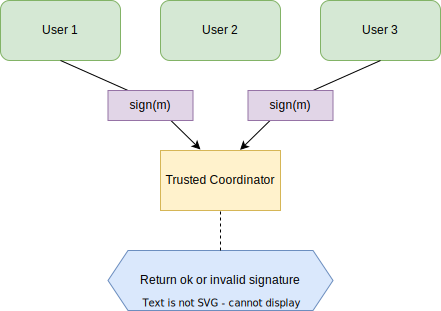
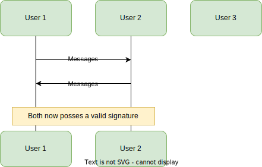

Entropy is a layer one chain for decentralized signing infrastructure.

The Entropy network provides threshold signing as a service. It consists of a proof of stake application chain built with [Substrate](https://substrate.io/) where each validator node deploys a [threshold signing client](https://en.wikipedia.org/wiki/Threshold_cryptosystem) which holds secret key-shares. The decision as to whether the network will collectively sign a particular message is determined by a predefined program.

Entropy's [threshold signature scheme](../concepts/threshold-signature-scheme.md) uses the [Elliptic Curve Digital Signature Algorithm (ECDSA)](https://en.wikipedia.org/wiki/Elliptic_Curve_Digital_Signature_Algorithm), with support for signing [Ethereum Virtual Machine (EVM)](https://ethereum.org/en/developers/docs/evm/) transactions as well as arbitrary data. Support for other signature schemes is planned. This gives us a blockchain-agnostic programmable signing infrastructure.

Entropy's [Programs](../concepts/programs) are stored on chain as [WebAssembly](https://webassembly.org/). They are mutable and may be updated by signing a transaction using the "account key," which is defined during that account's initial registration. There are plans for governance mechanisms for managing Program updates as an organization, or issuing emergency fixes.

The Entropy blockchain is used for consensus about which validator nodes hold which key-shares, provides a mechanism for excluding nodes which do not adhere to the signing protocol, and stores the Programs associated with an account. Once a user is registered with an account, signing a message with Entropy does not require submitting a transaction to the Entropy chain. This means getting a signature is fast and costs nothing.

An initial use case for entropy is a **decentralized asset custodian**, where the Program defines under what conditions funds or assets can be moved. Further use cases for Entropy Programs include **intent settlement** and **attestations**.

There's a lot to unpack here. What's an Asset Custodian? Why would we need a chain, and how do we guarantee that it will be decentralized? How does this relate to a multisignature? What's the deal with the TSS? This post unpacks all that and more.

## Asset Custodian? 👉️👈️

An asset custodian is a service that holds your funds, like a wallet. The "you" in this case could be just you, or it could be you and a whole organization. An asset custodian should be able to do a couple of things that most wallets can't:

- You may have funds across **multiple addresses**, and maybe across **multiple chains**. An asset custodian should be a **single interface** between you and all of these accounts. We call the capacity to interoperate with all chains being **chain agnostic**.
- An asset custodian should be able to represent **multi-user accounts**: accounts with shared access by multiple parties. The **permissions** for each of these parties may be different. Some transactions may require multi-user sign-off, as in a multisignature.
- A user should be able to specify **arbitrary constraints** on how funds move through the custodian. Features like **per-user time-bound spending limits**, **time-locked transactions**, and **how each user interacts with the custodian** should be able to be flexibly set by the user or organization.
- The custodian should be **well-secured**, while anticipating the need for emergency scenarios for **secure account recovery**.

We further believe that services should be **censorship resistant**, **credibly neutral**, and **transparent to users**. We believe that **decentralization** is the only effective way to guarantee these properties. Eliminating centralized intermediary service providers reduces the ways for services to become targets for manipulation and attack.

Smart contract applications achieve decentralization by delegating the execution of application logic to a set of decentralized service providers: miners or validators, or more generally, nodes.

Smart contracts are very powerful primitives for building decentralized applications. But **smart contracts are limited** to the set of operations exposed by the smart contract infrastructure. Smart contracts typically cannot do any of the following things:

- Instruct nodes to make calls outside the network (chain)
- Hold private state
- Cheaply perform computation-intensive operations, like those often required by cryptography
- Automate recurring or scheduled computation
- Change or update rules for how to execute themselves; upgradeable contracts solve this but create other problems
- Change properties of the underlying network (block times, transaction subsidy rules, privacy features, etc.)

The construction of a **Chain-Agnostic Decentralized Asset Custodian** relies on these features. Since platforms providing smart contracts lack these features, Entropy would be impossible to construct on a smart contract platform. This is why we need to build our own chain.

But building our own chain requires us to consider _how_ we will achieve decentralization. Decentralization is a complex topic, and some application chains have been accused of being very not-decentralized. Let's unpack that next.

## But is it Decentralized AF?\*\*

Smart contracts share security and decentralization properties with the underlying network. The most basic metric for decentralization is node count. At the time of writing (August 2023), there are about [14,700](https://www.nodewatch.io/) Ethereum nodes, and [16,000](https://bitnodes.io/nodes/) Bitcoin nodes. However, because each infrastructure provider is only minimally incentivized, the [Ethereum](https://www.statista.com/statistics/1334652/ethereum-eth-biggest-staking-pool-groups/) and [Bitcoin](https://blockchair.com/bitcoin/charts/hashrate-distribution) networks rely on pooled node operators. In recent events, [a particular smart contract](https://www.coindesk.com/layer2/2022/09/28/the-problem-tornado-cash-raises-about-base-layer-censorship-on-ethereum/) has been heavily censored on the Ethereum network, as pooled node operators refuse to include transactions involving the smart contract.

Application chains tend to have fewer nodes than general smart contract platforms. But there is an advantage in finding a middle ground: node operators actually run their own nodes. Decentralization is not a monolithic property; attempting to increase node count arbitrarily can ironically **decrease the decentralization** of a network by, perversely, incentivizing consolidation. By finding a middle ground in node count, a network can avoid the situation where nodes have consolidated into 3 node pools controlling over 50% of a network's resources, for example.

The Entropy Network will stay at a size which provides for a variety of independent validators while maintaining signing performance. Besides decentralization, there are other reasons we would intentionally choose to keep the node count in this middle ground.

Because Entropy's nodes hold onto shares of private user information (more on that in the next section), there are strong anti-incentives in allowing nodes to join and leave the network frequently. For these reasons, the number of nodes on the Entropy Network needs to be high enough to guarantee decentralized service, but not so high as to misalign the incentives of Entropy validators against users.

We're going to shift attention now to how Entropy works.

## Hello, I would like one cryptography

The easiest way to explain a Threshold Signature Scheme (TSS) is to start with a multisignature.

A $t$-of-$n$ multisignature is a way for $t$ (**t**hreshold) participants out of $n$ possible participants to construct a valid signature.

Each participant signs a message with their private key. A trusted centralized coordinator verifies that the $t$ signatures are valid. In blockchain contexts, the central coordinator is typically spelled "smart contract."

_2-of-3 Multisignature_

Similarly, a $t$-of-$n$ TSS is a way for $t$ participants out of $n$ possible participants to construct a valid signature, but **without a centrally trusted coordinator.**

Participants in a threshold signature scheme don't hold onto independent private keys. Before a signature can be constructed, a set of key-shares is generated. This is done either by a process of **Distributed Key Generation (DKG)** that all parties participate in, or by a **Centralized Key Generation** process where a single party _splits_ a private key into shares and distributes them to the other parties. Distributed key generation processes have the advantage that every party contributes randomness to generate the private key, but _no party has knowledge of the shared private key_. A threshold signature scheme constructs valid signatures despite the fact that no party has knowledge of this shared private key.

Threshold signatures schemes eliminate the requirement for a trusted coordinator, and are a powerful and flexible cryptographic primitive.

_2-of-3 Threshold Signature Scheme_

In the Entropy scheme, key shares are generally custodied by nodes on the Entropy Network, while with Entropy's private access mode, the user holds onto one or more key shares.

Much like a multisignature, the Entropy Network is a decentralized intermediary between users and their funds. But, unlike a multisignature, Entropy can represent and custody funds sitting on any other blockchain, without complicated cross-chain communication. Here's how.

## Entropy in 3️⃣0️⃣ seconds 🕐️

Alice, a user or organization, wants to construct a transaction for chain X, from her Entropy-managed account.

- Alice gets the list of threshold signing servers who have her key-shares from the Entropy chain.
- A signing committee is selected from this list based on the hash of the particular message she wants to sign.
- Alice makes a request to each member of the signing committee containing the transaction or message she wants to sign, asking the Entropy Network to consult the Program and construct a signature.
- Each of these threshold signing servers retrieves the latest version of the associated Program from the Entropy chain and executes it with the message to be signed as input.
- If the Program returns success, the threshold signing servers in the signing committee connect to each other and execute the threshold signing protocol, producing a valid signature.
- If the signature fails, the signers are able to prove the identity of the malicious co-signer. This proof can be published in the next block as a slashing-attestation for that node, and a new signing party may be selected.
- The Entropy front end asks Alice to confirm before submitting the transaction to chain X, at which point it is submitted as a normal transaction on chain X.

The scope of the Entropy Network is well-constrained: check validity, allow users to adjust the definition of validity, and construct signatures over valid messages.

Because threshold signature schemes can be performed "off-chain" (from the perspective of the transaction endpoint) while still producing a valid signature, the final transaction is **much less expensive than a smart contract call**. The scheme is also credibly **decentralized**. Unlike centralized custody solutions, the Entropy Network distributes responsibility for operating the custodian. Additionally, the network can elegantly represent accounts on **any other chain** without relying on expensive cross-chain communication.

## Wrap up

So, yeah. In this 'splainer we tried to unpack:

- The distinction between the Entropy signing protocol and the application-level programs which determine what can be signed. 
- The different access modes associated with these programs.
- A decentralized asset custodian as an initial use-case, and how it relates to a wallet or a multisignature.
- How application chains can achieve decentralization, despite smaller node pools.
- How threshold signature schemes (TSS) as implemented by threshold signing servers (also, TSS) differ from multisignatures.
- How the Entropy Network will work, as a new kind of decentralized infrastructure for securing your funds.

Keep an eye out for our upcoming testnet release!
