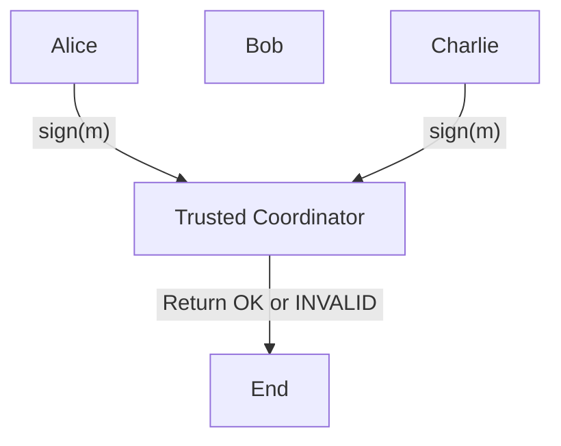
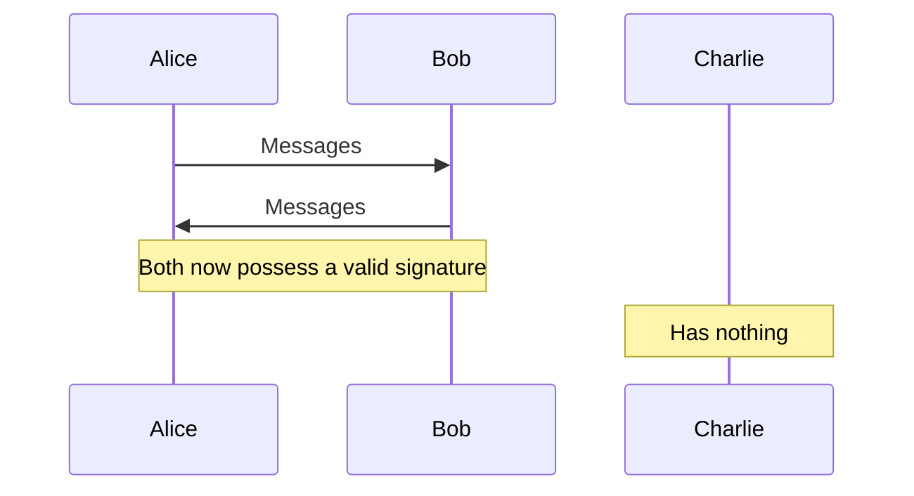

Мережа Entropy надає порогове підписання як послугу. Він складається з ланцюжка додатків для підтвердження частки, створеного за допомогою [Substrate](https://substrate.io/) , де кожен вузол валідатора розгортає [клієнта порогового підпису](https://en.wikipedia.org/wiki/Threshold_cryptosystem) , який зберігає секретні ключі. Рішення про те, чи буде мережа спільно підписувати конкретне повідомлення, визначається заздалегідь визначеною програмою.

[Схема порогового підпису Entropy]() використовує [алгоритм цифрового підпису еліптичної кривої (ECDSA)](https://en.wikipedia.org/wiki/Elliptic_Curve_Digital_Signature_Algorithm) із підтримкою підпису [віртуальної машини Ethereum (EVM)](https://ethereum.org/en/developers/docs/evm/) транзакції, а також довільні дані. Планується підтримка інших схем підпису. Це дає нам незалежну від блокчейну програмовану інфраструктуру підпису.

[Програми Entropy]() зберігаються в ланцюжку як [WebAssembly](https://webassembly.org/) . Вони змінні та можуть бути оновлені шляхом підписання транзакції за допомогою «ключа облікового запису», який визначається під час початкової реєстрації цього облікового запису. Існують плани щодо механізмів управління для керування оновленнями програм як організації або видачі екстрених виправлень.

Блокчейн Entropy використовується для досягнення консенсусу щодо того, які вузли перевірки мають спільний ключ, забезпечує механізм виключення вузлів, які не дотримуються протоколу підпису, і зберігає програми, пов’язані з обліковим записом. Після того, як користувач зареєстрований в обліковому записі, для підписання повідомлення за допомогою Entropy не потрібно надсилати транзакцію до ланцюжка Entropy. Це означає, що отримання підпису є швидким і безкоштовним.

Початковий варіант використання Entropy – це **децентралізований зберігач активів** , де Програма визначає, за яких умов можна переміщувати кошти чи активи. Інші варіанти використання програм Entropy включають **врегулювання намірів** і **атестації** .

Тут є що розпакувати. Що таке зберігач активів? Навіщо нам мережа і як ми гарантуємо, що вона буде децентралізованою? Як це пов’язано з мультипідписом? Яка справа з TSS? Ця публікація розповідає про все це та багато іншого.

## Зберігач активів

Зберігач активів – це служба, яка зберігає ваші кошти, як гаманець. «Ви» в цьому випадку можете бути лише вами, або це можете бути ви та ціла організація. Зберігач активів повинен вміти робити пару речей, які не можуть більшість гаманців:

- Ви можете мати кошти за **кількома адресами** та, можливо, за **кількома мережами** . Зберігач активів має бути **єдиним інтерфейсом** між вами та всіма цими обліковими записами. Ми називаємо здатність взаємодіяти з усіма ланцюгами **ланцюгом агностиком** .
- Зберігач активів повинен мати можливість представляти **багатокористувацькі облікові записи** : облікові записи зі спільним доступом кількох сторін. **Дозволи** для кожної з цих сторін можуть бути різними. Для деяких транзакцій може знадобитися багатокористувацький підпис, наприклад, мультипідпис.
- Користувач повинен мати можливість вказати **довільні обмеження** щодо того, як кошти переміщуються через зберігача. Користувач або організація повинні мати можливість гнучко встановлювати такі функції, як **обмежені за часом ліміти витрат для кожного користувача** , **заблоковані за часом транзакції** та **те, як кожен користувач взаємодіє зі зберігачем** .
- Зберігач має бути **надійно захищений** , передбачаючи потребу в екстрених сценаріях для **безпечного відновлення облікового запису** .

Крім того, ми вважаємо, що служби мають бути **стійкими до цензури** , **нейтральними** та **прозорими для користувачів** . Ми вважаємо, що **децентралізація** є єдиним ефективним способом гарантувати ці властивості. Усунення централізованих постачальників посередницьких послуг скорочує можливості для послуг, щоб стати мішенями для маніпуляцій і атак.

Додатки смарт-контрактів досягають децентралізації шляхом делегування виконання логіки додатків набору децентралізованих постачальників послуг: майнерів або валідаторів або, загалом, вузлів.

Розумні контракти є дуже потужними примітивами для створення децентралізованих додатків. Але **смарт-контракти обмежені** набором операцій, доступних інфраструктурі смарт-контрактів. Смарт-контракти зазвичай не можуть виконувати будь-що з наведеного нижче.

- Вказуйте вузлам здійснювати дзвінки за межами мережі (ланцюг)
- Тримайте приватний стан
- Дешево виконуйте інтенсивні обчислювальні операції, такі як ті, які часто потрібні для криптографії
- Автоматизуйте повторювані або заплановані обчислення
- Змінити або оновити правила для виконання; Контракти з можливістю оновлення вирішують це, але створюють інші проблеми
- Зміна властивостей основної мережі (час блокування, правила субсидування транзакцій, функції конфіденційності тощо)

Побудова **децентралізованого зберігача активів, незалежного від ланцюга,** базується на цих функціях. Оскільки платформи, що надають смарт-контракти, не мають цих функцій, Entropy було б неможливо побудувати на платформі смарт-контрактів. Ось чому нам потрібно побудувати власну мережу.

Але побудова власного ланцюга вимагає від нас подумати про _те, як_ ми досягнемо децентралізації. Децентралізація — це складна тема, і деякі ланцюжки додатків звинувачують у тому, що вони дуже недецентралізовані. Давайте розпакуємо це далі.

## Але чи децентралізовано

Розумні контракти мають спільні властивості безпеки та децентралізації з основною мережею. Основним показником децентралізації є кількість вузлів. На момент написання статті (серпень 2023 року) існує близько [14 700](https://www.nodewatch.io/) вузлів Ethereum і [16 000](https://bitnodes.io/nodes/) вузлів Bitcoin. Однак, оскільки кожен постачальник інфраструктури має лише мінімальні стимули, мережі [Ethereum](https://www.statista.com/statistics/1334652/ethereum-eth-biggest-staking-pool-groups/) і [Bitcoin](https://blockchair.com/bitcoin/charts/hashrate-distribution) покладаються на операторів пулів вузлів. Під час останніх подій [певний смарт-контракт](https://www.coindesk.com/layer2/2022/09/28/the-problem-tornado-cash-raises-about-base-layer-censorship-on-ethereum/) зазнав жорсткої цензури в мережі Ethereum, оскільки оператори вузлів пулу відмовляються включати транзакції, що включають смарт-контракт.

Ланцюжки додатків, як правило, мають менше вузлів, ніж загальні платформи смарт-контрактів. Однак у пошуку золотої середини є перевага: оператори вузлів фактично керують своїми власними вузлами. Децентралізація не є монолітною власністю; спроба довільного збільшення кількості вузлів може за іронією долі **зменшити децентралізацію** мережі шляхом, навпаки, стимулювання консолідації. Знайшовши золоту середину в кількості вузлів, мережа може уникнути ситуації, коли вузли консолідуються в три пули вузлів, які контролюють, наприклад, понад 50% ресурсів мережі.

Мережа Entropy залишиться на такому розмірі, який забезпечить різноманітність незалежних валідаторів, зберігаючи продуктивність підпису. Крім децентралізації, є й інші причини, з яких ми б навмисно вирішили зберегти кількість вузлів на цьому середньому рівні.

Оскільки вузли Entropy зберігають частки приватної інформації користувача (докладніше про це в наступному розділі), існують сильні антистимули, дозволяючи вузлам часто приєднуватися та залишати мережу. З цих причин кількість вузлів у мережі Entropy має бути достатньо великою, щоб гарантувати децентралізоване обслуговування, але не настільки, щоб не співставляти стимули валідаторів Entropy проти користувачів.

Зараз ми збираємося переключити увагу на те, як працює Entropy.

## Криптографія

Найпростіший спосіб пояснити схему порогового підпису (TSS) — почати з мультипідпису.

Мультипідпис t -of -n — це спосіб для t ( **t** порогових) учасників із n можливих учасників створити дійсний підпис.

Кожен учасник підписує повідомлення своїм закритим ключем. Довірений централізований координатор перевіряє дійсність підписів t . У контексті блокчейну центральний координатор зазвичай пишеться як «розумний контракт».

_Мультипідпис 2 із 3_

Подібним чином t -of -n TSS є способом для t учасників з n можливих учасників створити дійсний підпис, але **без централізованого довіреного координатора.**

Учасники порогової схеми підпису не зберігають незалежні закриті ключі. Перед створенням підпису створюється набір спільних ключів. Це робиться за допомогою процесу **розподіленої генерації ключів (DKG)** , у якому беруть участь усі сторони, або за допомогою **централізованого процесу генерації ключів** , коли одна сторона _розділяє_ закритий ключ на частки та розповсюджує їх іншим сторонам. Процеси генерації розподілених ключів мають ту перевагу, що кожна сторона вносить випадковий внесок у генерацію закритого ключа, але _жодна зі сторін не знає про спільний закритий ключ_ . Порогова схема підпису створює дійсні підписи, незважаючи на те, що жодна сторона не знає про цей спільний закритий ключ.

Схеми порогового підпису усувають вимогу щодо довіреного координатора та є потужним і гнучким криптографічним примітивом.

_Схема порогового підпису 2 із 3_

У схемі Entropy спільні ключі зазвичай зберігаються вузлами в мережі Entropy, тоді як у режимі приватного доступу Entropy користувач має один або більше спільних ключових ресурсів.

Подібно до мультипідпису, Entropy Network є децентралізованим посередником між користувачами та їхніми коштами. Але, на відміну від мультипідпису, Entropy може представляти та зберігати кошти, що знаходяться в будь-якому іншому блокчейні, без складного перехресного зв’язку. Ось як.

## Наскрізний робочий процес

Аліса, користувач або організація, хоче створити транзакцію для ланцюжка `X` зі свого облікового запису, яким керує Entropy.

- Аліса отримує список серверів порогового підпису, які мають спільні ключі з ланцюга Entropy.
- Комітет підписання вибирається з цього списку на основі хешу конкретного повідомлення, яке вона хоче підписати.
- Аліса надсилає запит кожному члену комітету підписання, що містить транзакцію чи повідомлення, які вона хоче підписати, з проханням до мережі Entropy звернутися до Програми та створити підпис.
- Кожен із цих порогових серверів підпису отримує останню версію пов’язаної програми з ланцюжка Entropy і виконує її з повідомленням, яке потрібно підписати як вхідні дані.
- Якщо програма повертає успіх, сервери порогового підпису в комітеті підпису підключаються один до одного та виконують протокол порогового підпису, створюючи дійсний підпис.
- Якщо підпис не вдається, підписанти можуть довести особу зловмисного співпідписувача. Це підтвердження можна опублікувати в наступному блоці як різну атестацію для цього вузла, і може бути обрана нова сторона підпису.
- Інтерфейс Entropy просить Алісу підтвердити, перш ніж надсилати транзакцію в ланцюжок X, після чого вона надсилається як звичайна транзакція в ланцюжку X.

Сфера дії Entropy Network добре обмежена: перевіряйте валідність, дозволяйте користувачам коригувати визначення дійсності та створюйте підписи над дійсними повідомленнями.

Оскільки порогові схеми підпису можуть виконуватися поза ланцюгом (з точки зору кінцевої точки транзакції), але при цьому створювати дійсний підпис, остаточна транзакція **набагато дешевша, ніж виклик смарт-контракту** . Схема також є достовірно **децентралізованою** . На відміну від рішень централізованого зберігання, Entropy Network розподіляє відповідальність за роботу зберігача. Крім того, мережа може елегантно представляти облікові записи в **будь-якому іншому ланцюжку,** не покладаючись на дорогий міжланцюговий зв’язок.

## Закутувати

Отже, так. У цьому поясненні ми спробували розпакувати наступне:

- Різниця між протоколом підпису Entropy і програмами прикладного рівня, які визначають, що можна підписати.
- Різні режими доступу, пов’язані з цими програмами.
- Децентралізований зберігач активів як початковий варіант використання та його зв’язок із гаманцем або мультипідписом.
- Як ланцюги програм можуть досягти децентралізації, незважаючи на менші пули вузлів.
- Чим схеми порогових підписів (TSS), реалізовані серверами порогових підписів (також TSS), відрізняються від мультипідписів.
- Як працюватиме Entropy Network як новий тип децентралізованої інфраструктури для захисту ваших коштів.
