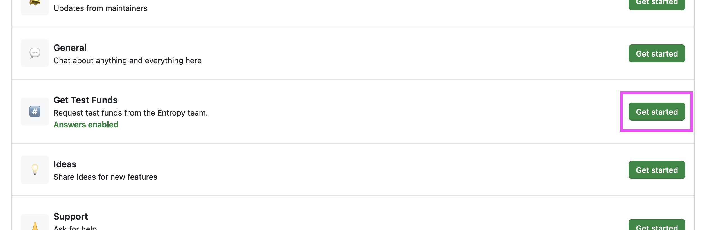


If you'd prefer to dive into the core concepts of Entropy instead of running through this quickstart, head over to the [Entrosplainer to learn how the project works]()!


## What is Entropy



The Entropy network provides threshold signing as a service. That means multiple users can collectively sign  a message to perform _some_ function on any blockchain network. Entropy can also be used to perform non-blockchain tasks like encrypting and decrypting chunks of data. That's all we will cover now, but you'll learn more about Entropy in other parts of this docs website.

## 1. Install CLI

The command-line interface (CLI) is the most straightforward way to interact with Entropy from your device.

1. Ensure you have Node.js version 20.9.0 or above:

    ```shell
    node --version
    ```

    ```output
    v22.2.0
    ```

1. Install the Entropy CLI globally using NPM:

    ```shell
    npm install --global @entropyxyz/cli
    ```

1. Run the CLI using `entropy`:

    ```shell
    entropy
    ```

    ```output
    @@@@@@@@@@ @@@@@@@@@@ @@@@@   @@@@@@@@@@@ @@@@@@@@@ @@@@@@@@@@ @@@@@ @@@@@
    @@@@@@@@@@ @@@@@@@@@@ @@@@@   @@@@@@@@@@@ @@@@@@@@@ @@@@@@@@@@ @@@@@ @@@@@
    @@@@@@@@@@ @@@@@@@@@@ @@@@@@@ @@@@@@@@@@@ @@@@@@@@@ @@@@@@@@@@ @@@@@ @@@@@
    @@@@@ @@@@ @@@@@ @@@@ @@@@@@@ @@@@@ @@@@@ @@@@ @@@@ @@@@@ @@@@ @@@@@ @@@@@
    @@@@@ @@@@ @@@@@ @@@@ @@@@@   @@@@@ @@@@@ @@@@ @@@@ @@@@@ @@@@ @@@@@ @@@@@
    @@@@@ @@@@ @@@@@ @@@@ @@@@@   @@@@@ @@@@@ @@@@ @@@@ @@@@@ @@@@ @@@@@ @@@@@
    @@@@@@@@@@ @@@@@ @@@@ @@@@@   @@@@@       @@@@ @@@@ @@@@@ @@@@ @@@@@ @@@@@
    @@@@@@@@@@ @@@@@ @@@@ @@@@@   @@@@@       @@@@ @@@@ @@@@@ @@@@ @@@@@ @@@@@
    @@@@@      @@@@@ @@@@ @@@@@   @@@@@       @@@@ @@@@ @@@@@ @@@@ @@@@@ @@@@@
    @@@@@ @@@@ @@@@@ @@@@ @@@@@   @@@@@       @@@@ @@@@ @@@@@ @@@@ @@@@@ @@@@@
    @@@@@ @@@@ @@@@@ @@@@ @@@@@   @@@@@       @@@@ @@@@ @@@@@ @@@@ @@@@@ @@@@@
    @@@@@ @@@@ @@@@@ @@@@ @@@@@   @@@@@       @@@@ @@@@ @@@@@ @@@@ @@@@@ @@@@@
    @@@@@@@@@@ @@@@@ @@@@ @@@@@@@ @@@@@       @@@@@@@@@ @@@@@@@@@@ @@@@@@@@@@@
    @@@@@@@@@@ @@@@@ @@@@ @@@@@@@ @@@@@       @@@@@@@@@ @@@@@@@@@@ @@@@@@@@@@@               
                                                        @@@@@@            TEST               
                                                        @@@@@@            *NET               
                                                        @@@@@@     ENTROPY-CLI               
                                                        @@@@@@     
    ? Select Action (Use arrow keys)
    ❯ Manage Accounts
      Balance
      Register
      Sign
      Transfer
      Deploy Program
      User Programs
      Exit
    ```


**Closing the CLI**: You can close the CLI tool anytime by pressing `CTRL` + `c`. This will halt the CLI process and return you to your normal terminal window.


Next, you'll create an Entropy .

## 2. Create an account

You need funds to interact with the Entropy network. Your funds are stored in an account. You can have multiple accounts.

1. Select **Manage Accounts**.
1. Select **Create/Import Account**.
1. Type `n` and press `ENTER` when asked _Would you like to import a key?_:

    ```output
    ? Would you like to import a key? n
    ```

1. Enter the name of your new account. The CLI will output some information about it:

    ```output
    New account:
    {
            name: MyFirstAccount
            address: 5HMnksPMRPqsDqyCj31VoQFgpiswsr12bk2YTyfMUEKCm2bv
    }
    ```

    Make a note of the `address` field. You'll need that in the next step.

1. Type `Y` and press `ENTER` to return to the main menu.

Next up, you'll request some funds to play around with.

## 3. Get testing funds

You need funds to interact with the Entropy blockchain network. To get these testing funds, you will need a GitHub account.

1. Log into your GitHub account and go to [github.com/entropyxyz/community](https://github.com/entropyxyz/community).
1. Navigate to the **Discussions** tab and select **New discussion**.
1. Next to **Get Test Funds** click **Get started**:

    

1. In the **Title** field, enter the `address` you copied from the previous section.
1. Enter any text into the **Description** field; GitHub doesn't allow users to leave this field blank. If you need more than 10,000 test funds, enter the amount of funds you need and why into this field.
1. Click **Start discussion**.

At this point, someone from Entropy will send you some test funds. Once they've sent the funds to your provided address, they'll let you know and close the issue.


We're currently publically testing some of the Entropy tooling. As such, some of the workflows, like getting test funds, are a bit rough. We're building an automated faucet to hand out test funds, and we'll update this page when it's ready.


Once you have been sent some funds, you can check your balance in the CLI.

6. Open the CLI text-based user interface using `yarn start`.
1. Select **Balance** from the menu.
1. You should see your account in the list. Use the arrow keys to highlight it and press `ENTER`.
1. The CLI should show your balance:

    ```output
    ? Select Action Balance
    Address 5Dcps2RdXPQfiJBxxDnrF8iDzDHcnZC8rb5mcJ3xicqzhYbv has a balance of: 100000000000000 bits
    ```

Next, you'll register your account on the Entropy network.

## 4. Register your account

Registering an account is a feature unique to Entropy. Without going into too much detail, it advertises to the network that you own _this_ account and that you're ready to start signing things.

1. Back at the main menu within the CLI, select **Register**:

    ```output
    ? Select Action
      Manage Accounts
      Balance
    > Register
      Sign
      Transfer
      Deploy Program
      User Programs
      Exit    
    ```

1. The CLI will send your selected account information to the network. The network will then register your account as long as you have enough funds.

    ```output
    Attempting to register the address: 5Dcps2RdXPQfiJBxxDnrF8iDzDHcnZC8rb5mcJ3xicqzhYbv
    Your address 5Dcps2RdXPQfiJBxxDnrF8iDzDHcnZC8rb5mcJ3xicqzhYbv has been successfully registered.
    ```

1. Press `Y` to go back to the main menu.

Next up, we'll attempt to get a signature from the network!

## 5. Get a signature

1. Back at the main menu within the CLI, select **Sign**:

    ```output
    ? Select Action
      Manage Accounts
      Balance
      Register
    > Sign
      Transfer
      Deploy Program
      User Programs
      Exit
    ```

1. Select **Sign With Adapter**.
1. Select **Text Input**.
1. The CLI will prompt you to enter a message in the default terminal-based text editor on your system:

    ```output
    ? Enter the message you wish to sign (this will open your default editor): Press <enter> to launch your preferred editor.
    ```

1. Press `ENTER` to open a text editor.
1. Within your text editor, enter a message. It doesn't matter what the message is at this point.
1. Once you have finished entering your message into the text editor, save and quit the text editor.
1. The CLI should output a `Uint8Array` signature:

    ```output
    signature: Uint8Array(65) [
        205,  50, 230, 124,  87,  36,  31,  59, 120, 211, 254,
        244,  29,  69, 194, 137,   1, 235, 195, 223,  77,   1,
        115,  52, 194, 219, 184,  49,  54, 222, 137,  17,  47,
        89,  77, 244,  50, 151, 103, 233,  81, 123,  59, 102,
        247,  71, 223,  28,  15, 200, 138, 156, 223, 114,  51,
        89, 145,  10,  49, 233, 239, 231, 150,  58,   1
    ]
    ```

Congratulations! You just received a signature from the Entropy network using the CLI!

So, what was all that about? While this quickstart guide didn't go into much detail regarding the theory of what you just did and why, you should now have a solid understanding of the steps available to you using Entropy.

## Next steps

There's much more to come from Entropy! Next, you should check out the [Entrosplainer](), an end-to-end explanation of what Entropy is, why it's necessary, and how it works!

