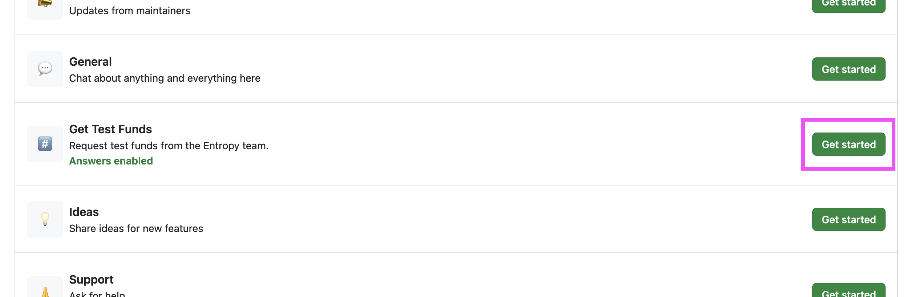


Якщо ви бажаєте заглибитися в основні поняття Entropy замість цього короткого посібника, перейдіть до [Entrosplainer, щоб дізнатися, як працює проект]()!


## Що таке ентропія

Мережа Entropy надає порогове підписання як послугу. Це означає, що кілька користувачів можуть колективно підписати повідомлення для виконання _деяких_ функцій у будь-якій мережі блокчейн. Entropy також можна використовувати для виконання завдань, не пов’язаних з блокчейном, наприклад шифрування та дешифрування фрагментів даних. Це все, що ми зараз розглянемо, але ви дізнаєтеся більше про Entropy в інших частинах цього веб-сайту документів.

## 1. Встановіть CLI

Інтерфейс командного рядка (CLI) — це найпростіший спосіб взаємодії з Entropy із вашого пристрою.

1. Переконайтеся, що у вас Node.js версії 20.9.0 або вище:

 ```шкаралупа
 вузол --версія
 ```

 ``` вихід
 v22.2.0
 ```

1. Встановіть Entropy CLI глобально за допомогою NPM:

 ```шкаралупа
 npm install --global @entropyxyz/cli
 ```

1. Запустіть CLI за допомогою `entropy`:

 ```шкаралупа
 ентропія
 ```

 ``` вихід
 @@@@@@@@@@ @@@@@@@@@@ @@@@@ @@@@@@@@@@@ @@@@@@@@@ @@@@@@ @@@@@ @@@@@ @@@@@
 @@@@@@@@@@ @@@@@@@@@@ @@@@@ @@@@@@@@@@@ @@@@@@@@@ @@@@@@ @@@@@ @@@@@ @@@@@
 @@@@@@@@@@ @@@@@@@@@@ @@@@@@@ @@@@@@@@@@@ @@@@@@@@@@ @@@ @@@@@@@ @@@@@ @@@@@
 @@@@@ @@@@ @@@@@ @@@@ @@@@@@@ @@@@@ @@@@@ @@@@ @@@@ @@@@@ @@ @@ @@@@@ @@@@@
 @@@@@ @@@@ @@@@@ @@@@ @@@@@ @@@@@ @@@@@ @@@@ @@@@ @@@@@ @@@@ @@@@@ @@@@@
 @@@@@ @@@@ @@@@@ @@@@ @@@@@ @@@@@ @@@@@ @@@@ @@@@ @@@@@ @@@@ @@@@@ @@@@@
 @@@@@@@@@@ @@@@@ @@@@ @@@@@ @@@@@ @@@@ @@@@ @@@@@ @@@@ @@@@ @ @@@@@@
 @@@@@@@@@@ @@@@@ @@@@ @@@@@ @@@@@ @@@@ @@@@ @@@@@ @@@@ @@@@ @ @@@@@@
 @@@@@ @@@@@ @@@@ @@@@@ @@@@@ @@@@ @@@@ @@@@@ @@@@ @@@@@ @@@@ @
 @@@@@ @@@@ @@@@@ @@@@ @@@@@ @@@@@ @@@@ @@@@ @@@@@ @@@@ @@@@@ @@@@@
 @@@@@ @@@@ @@@@@ @@@@ @@@@@ @@@@@ @@@@ @@@@ @@@@@ @@@@ @@@@@ @@@@@
 @@@@@ @@@@ @@@@@ @@@@ @@@@@ @@@@@ @@@@ @@@@ @@@@@ @@@@ @@@@@ @@@@@
 @@@@@@@@@@ @@@@@ @@@@ @@@@@@@ @@@@@ @@@@@@@@@ @@@@@@@@@@@ @@@@@@@@@@@@
 @@@@@@@@@@ @@@@@ @@@@ @@@@@@@ @@@@@ @@@@@@@@@ @@@@@@@@@@@ @@@@@@@@@@@@
 @@@@@@ ТЕСТ
 @@@@@@ *NET
 @@@@@@ ENTROPY-CLI
 @@@@@@
 ? Виберіть дію (використовуйте клавіші зі стрілками)
 ❯ Керуйте обліковими записами
 Баланс
 зареєструватися
 Знак
 Трансфер
 Розгорнути програму
 Програми користувача
 Вихід
 ```


**Закриття CLI**: Ви можете будь-коли закрити інструмент CLI, натиснувши `CTRL` + `c`. Це призупинить процес CLI та поверне вас до звичайного вікна терміналу.


Далі ви створите обліковий запис Entropy.

## 2. Створіть обліковий запис

Вам потрібні кошти для взаємодії з мережею Entropy. Ваші кошти зберігаються на рахунку. Ви можете мати кілька облікових записів.

1. Виберіть **Керування обліковими записами**.
1. Виберіть **Створити/імпортувати обліковий запис**.
1. Введіть `n` і натисніть `ENTER`, коли вас запитають _Бажаєте ви імпортувати ключ?_:

 ``` вихід
 ? Бажаєте імпортувати ключ? п
 ```

1. Введіть назву вашого нового облікового запису. CLI виведе деяку інформацію про це:

 ``` вихід
 Новий акаунт:
 {
 назва: MyFirstAccount
 адреса: 5HMnksPMRPqsDqyCj31VoQFgpiswsr12bk2YTyfMUEKCm2bv
 }
 ```

 Зверніть увагу на поле «адреса». Це вам знадобиться на наступному кроці.

1. Введіть `Y` і натисніть `ENTER`, щоб повернутися до головного меню.

Далі ви попросите трохи коштів, щоб пограти.

## 3. Отримайте кошти на тестування

Вам потрібні кошти для взаємодії з мережею блокчейнів Entropy. Щоб отримати ці кошти для тестування, вам знадобиться обліковий запис GitHub.

1. Увійдіть у свій обліковий запис GitHub і перейдіть на сторінку [github.com/entropyxyz/community](https://github.com/entropyxyz/community).
1. Перейдіть на вкладку **Обговорення** та виберіть **Нове обговорення**.
1. Поруч із **Отримати тестові кошти** натисніть **Почати роботу**:

 

1. У полі **Назва** введіть `адресу`, яку ви скопіювали з попереднього розділу.
1. Введіть будь-який текст у поле **Опис**; GitHub не дозволяє користувачам залишати це поле порожнім. Якщо вам потрібно більше 10 000 тестових коштів, введіть у це поле необхідну суму коштів і чому.
1. Натисніть **Почати обговорення**.

На цьому етапі хтось із Entropy надішле вам тестові кошти. Щойно вони надішлють кошти на вказану вами адресу, вони повідомлять вас і закриють проблему.


Зараз ми публічно тестуємо деякі інструменти Entropy. Таким чином, деякі робочі процеси, як-от отримання тестових коштів, є дещо грубими. Ми створюємо автоматичний кран для роздачі тестових коштів, і ми оновимо цю сторінку, коли вона буде готова.


Після того, як вам надіслано певні кошти, ви можете перевірити свій баланс у CLI.

6. Відкрийте текстовий інтерфейс користувача CLI за допомогою `yarn start`.
1. Виберіть у меню **Баланс**.
1. Ви повинні побачити свій обліковий запис у списку. За допомогою клавіш зі стрілками виділіть його та натисніть `ENTER`.
1. CLI має показувати ваш баланс:

 ``` вихід
 ? Виберіть Action Balance
 Адреса 5Dcps2RdXPQfiJBxxDnrF8iDzDHcnZC8rb5mcJ3xicqzhYbv має баланс: 100000000000000 біт
 ```

Далі ви зареєструєте свій обліковий запис у мережі Entropy.

## 4. Зареєструйте свій обліковий запис

Реєстрація облікового запису є унікальною функцією Entropy. Не вдаючись у подробиці, він рекламує в мережі, що ви володієте _цим_ обліковим записом і що ви готові почати підписувати речі.

1. Поверніться в головне меню в CLI, виберіть **Реєстрація**:

 ``` вихід
 ? Виберіть Дія
 Керування обліковими записами
 Баланс
 > Зареєструватися
 Знак
 Трансфер
 Розгорнути програму
 Програми користувача
 Вихід
 ```

1. CLI надішле інформацію про ваш обліковий запис у мережу. Потім мережа зареєструє ваш обліковий запис, якщо у вас буде достатньо коштів.

 ``` вихід
 Спроба зареєструвати адресу: 5Dcps2RdXPQfiJBxxDnrF8iDzDHcnZC8rb5mcJ3xicqzhYbv
 Вашу адресу 5Dcps2RdXPQfiJBxxDnrF8iDzDHcnZC8rb5mcJ3xicqzhYbv успішно зареєстровано.
 ```

1. Натисніть `Y`, щоб повернутися до головного меню.

Далі ми спробуємо отримати підпис із мережі!

## 5. Отримайте підпис

1. Поверніться до головного меню в CLI, виберіть **Sign**:

 ``` вихід
 ? Виберіть Дія
 Керування обліковими записами
 Баланс
 зареєструватися
 > Підписати
 Трансфер
 Розгорнути програму
 Програми користувача
 Вихід
 ```

1. Виберіть **Підписати за допомогою адаптера**.
1. Виберіть **Введення тексту**.
1. Інтерфейс командного рядка запропонує вам ввести повідомлення в текстовому редакторі на основі терміналу за замовчуванням у вашій системі:

 ``` вихід
 ? Введіть повідомлення, яке ви хочете підписати (це відкриє ваш типовий редактор): Натисніть <enter>, щоб запустити бажаний редактор.
 ```

1. Натисніть `ENTER`, щоб відкрити текстовий редактор.
1. У текстовому редакторі введіть повідомлення. На даний момент не має значення, яке повідомлення.
1. Після завершення введення повідомлення в текстовий редактор збережіть і вийдіть із текстового редактора.
1. CLI виведе рядок у кодуванні `base64`:

 ``` вихід
 підпис: 0x4dc30d4b250900148b1facd054fdc611bd1c4103bf20409bf57fa04db5ba8fd00515ef9c497223e174ebad2bf69830997256c4081868b9f7f4b1f72 9eb8662ad00
 ```

Щиро вітаю! Ви щойно отримали підпис від мережі Entropy за допомогою CLI!

Отже, що це було? Хоча цей короткий посібник не вдавався в деталі теорії того, що ви щойно зробили і чому, тепер ви маєте чітко розуміти кроки, доступні вам за допомогою Entropy.

## Наступні кроки

Від Entropy можна отримати багато іншого! Далі вам слід ознайомитися з [Entrosplainer](), наскрізним поясненням того, що таке Entropy, чому вона потрібна та як вона працює!
