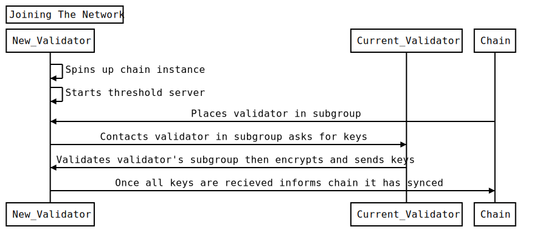

This page describes how a new validator node can join the network.

1. The new validator runs an Entropy chain node and threshold server.
1. New validator registers with the chain, and the chain is assigns it to a signing 'subgroup'.
1. Once a new validator knows which subgroup it has joined, it asks current validators in that group for a copy of the key shares that that group holds by calling POST `validator/sync_kvdb` with the database keys of the shares it needs.
1. Once all shares have been received, the node informs the chain that it has successfully synced.

## Information needed from a Validator to join the network

- `Endpoint` -  The IP address of its threshold server
- `X25519PublicKey` - Its public encryption key for encrypting messages to and from other validators
- `Threshold Server Signing Account` - Account for the threshold server to submit transactions to the Entropy chain
