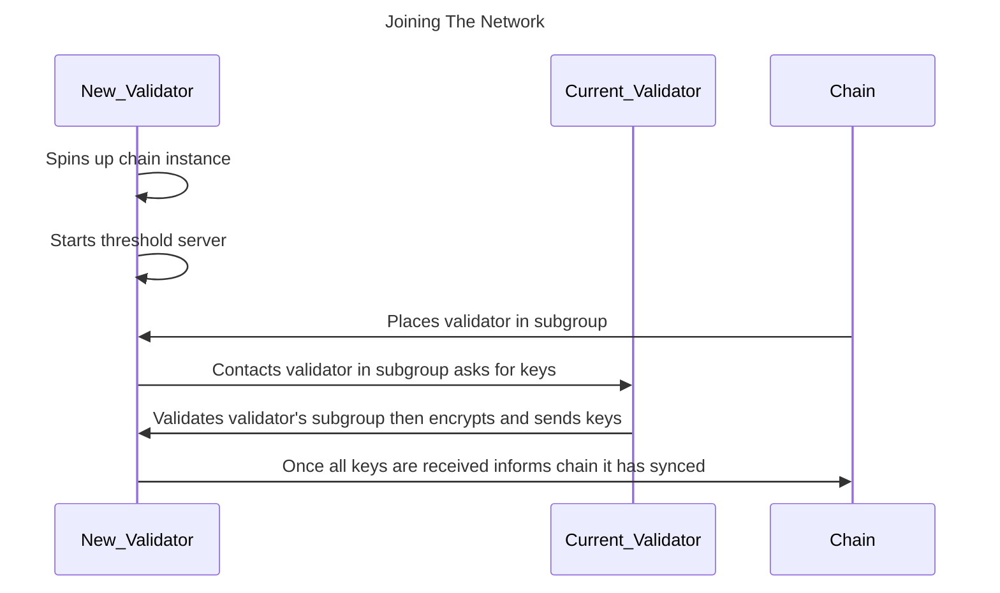


The network is not currently accepting public/user-ran validator nodes. We will [announce](https://github.com/entropyxyz/community/discussions/categories/announcements) ahead of time when we plan to start allowing new nodes to join the network.


## Joining process

The process works something like this:

1. The new validator operates an Entropy chain node and a threshold server.
1. This new validator registers with the chain, and the chain then assigns it to a _signing subgroup_.
1. Once a new validator is aware of the subgroup it has joined, it requests the current validators in that group for a copy of the key-shares specific to that subgroup. To make this request, it sends a 'POST' request to 'validator/sync_kvdb' with the database keys of the shares it needs.
1. After the new validator has received all the shares, the node notifies the chain that it has successfully synchronized.

## Required information

Each individual validator node requires the following information before it can join the network:

- **Endpoint**: The IP address of its threshold server.
- **X25519 Public Key**: Its public encryption key for encrypting messages to and from other validators.
- **Threshold Server Signing Account**: The account for the threshold server to submit transactions to the Entropy chain.
