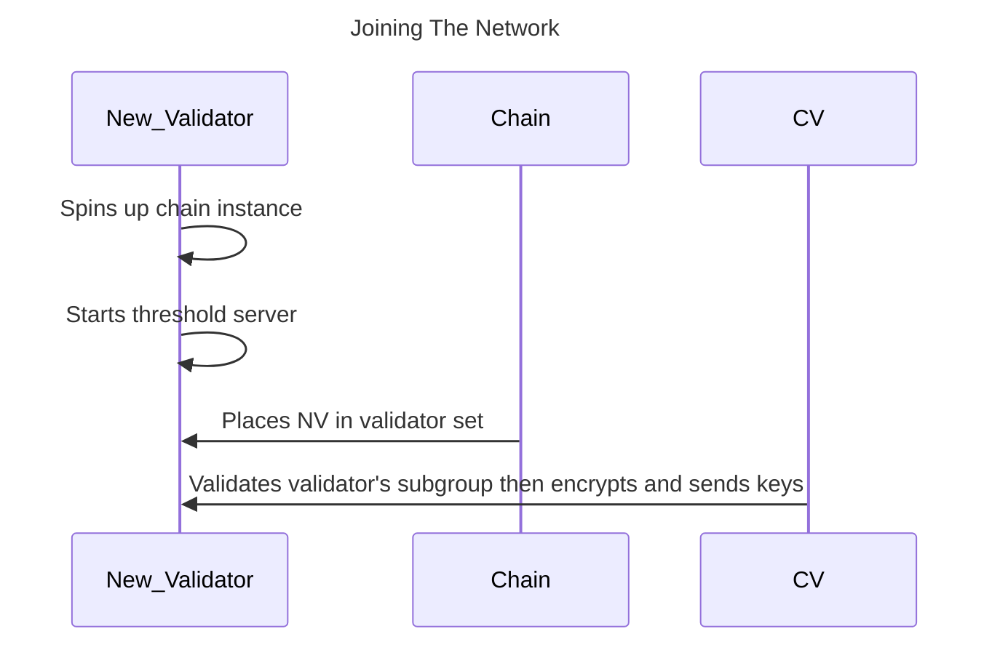


The network is not currently accepting public/user-ran validator nodes. We will [announce](https://github.com/entropyxyz/community/discussions/categories/announcements) ahead of time when we plan to start allowing new nodes to join the network.


## Joining process

The process works something like this:

1. The new validator operates an Entropy chain node and a threshold server.
1. This new validator registers with the chain.
1. If the stake is enough and the node gets selected to be a validator, it will act as a relayer and be eligible to be added to the signer set.

## Required information

Each individual validator node requires the following information before it can join the network:

- **Endpoint**: The IP address of its threshold server.
- **X25519 Public Key**: Its public encryption key for encrypting messages to and from other validators.
- **Threshold Server Signing Account**: The account for the threshold server to submit transactions to the Entropy chain.
