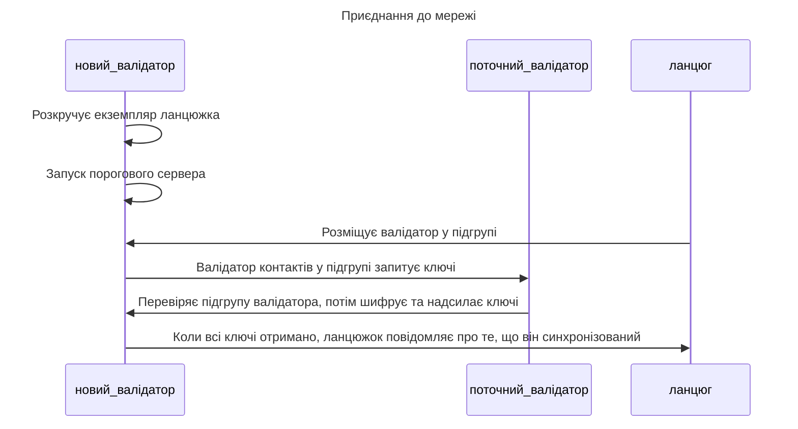


Мережа наразі не приймає загальнодоступні/запущені користувачами вузли перевірки. Ми [оголосимо](https://github.com/entropyxyz/community/discussions/categories/announcements) заздалегідь, коли плануємо дозволити новим вузлам приєднуватися до мережі.


## Процес приєднання

Процес працює приблизно так:

1. Новий валідатор керує вузлом ланцюга ентропії та пороговим сервером.
1. Цей новий валідатор реєструється в ланцюжку, а потім ланцюжок призначає його до _підгрупи підпису_.
1. Коли новий валідатор дізнається про підгрупу, до якої він приєднався, він запитує у поточних валідаторів у цій групі копію спільних ключів, характерних для цієї підгрупи. Щоб зробити цей запит, він надсилає запит «POST» до «validator/sync_kvdb» із ключами бази даних потрібних спільних ресурсів.
1. Після того, як новий валідатор отримав усі спільні ресурси, вузол сповіщає ланцюжок про успішну синхронізацію.

## Необхідна інформація

Кожному окремому вузлу перевірки потрібна така інформація, перш ніж він зможе приєднатися до мережі:

- **Кінцева точка**: IP-адреса його порогового сервера.
- **Відкритий ключ X25519**: його відкритий ключ шифрування для шифрування повідомлень до та від інших валідаторів.
- **Обліковий запис підпису порогового сервера**: обліковий запис для порогового сервера для надсилання транзакцій до ланцюга Entropy.
