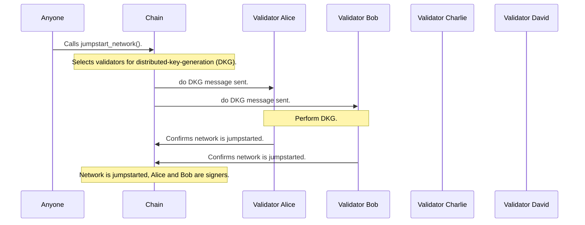

The network needs a "jump start" to be in a usefull state. Pretty much this means we need to do a network wide DKG to create the network parent key. This is started through a blockchain call which informs the selected TSSs to do a dkg. These TSSs will create the network parent key and create the first signing comittee.

Through reshares TSSs will get subbed in and out of the signing comittee. At registration user's are given a derivation off of the parent key and during signing we have a just in time key derivation to allow for singing for a given account. 

