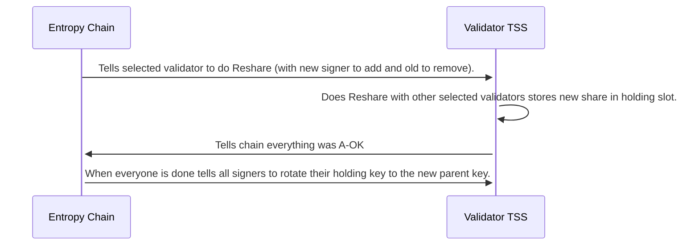

The idea here is that when validators join the network they may be selected to the signing comittee. A smaller randomly selected group of validators that is responsible for holding the parent network key. Every session, which consists of 2400 blocks (equivalent to 4 hours), the chain will notify the TSSs (Threshold Signature Servers) that a reshare is taking place. The chain will also reandomly select a validator to join the netowrk and remove the oldest signer from the comittee.

The selected TSSs will connect to each other and execute the key reshare protocol on the parent network key, generating a new set of key shares. This protocol is similar to the distributed key generation protocol used during jump starting the network. Upon receiving a new key share, the recipients will hold the new key share in a secondary slot and rotate them to the current parent network key when everyone in the signing group has agreed that the rotation was succeful. All previous key shares will be incompatible with the refreshed key shares. However, the public validating key of the parent network key signing keypair never changes. This means all child keys will also remain the same.

