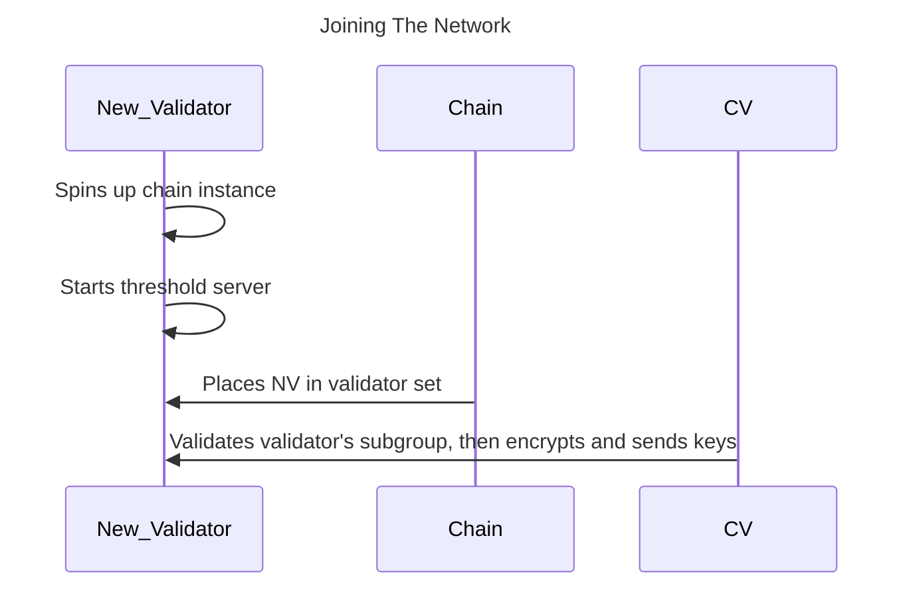
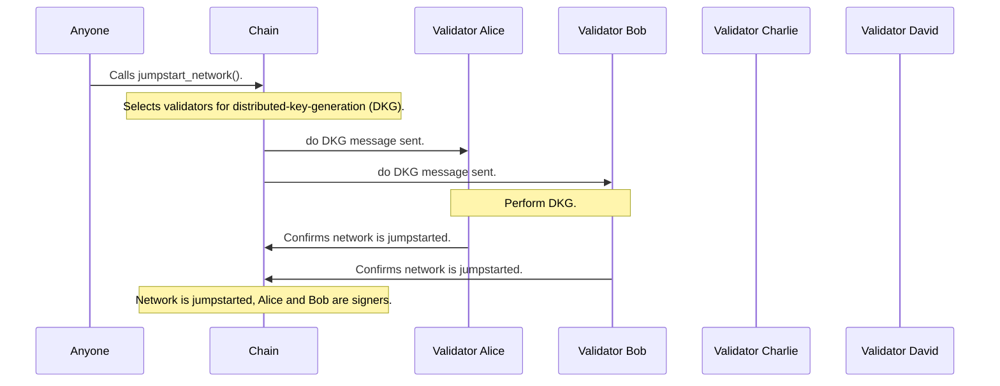

## Joining the network 

This section explains the process for validator nodes to join the network. The process works something like this:

1. The new validator operates an Entropy chain node and a threshold server.
1. This new validator registers with the chain.
1. If the stake is enough and the node gets selected to be a validator, it will act as a relayer and be eligible to be added to the signer set.


The network is not currently accepting public/user-ran validator nodes. We will [announce](https://github.com/entropyxyz/community/discussions/categories/announcements) when we plan to start allowing new nodes to join the network.


### Required information

Each validator node requires the following information before it can join the network:

- **Endpoint**: The IP address of its threshold server.
- **X25519 Public Key**: Its public encryption key for encrypting messages to and from other validators.
- **Threshold Server Signing Account**: The account for the threshold server to submit transactions to the Entropy chain.

## Jumpstart

The network needs a "jump start" to be in a usefull state. Pretty much this means we need to do a network wide DKG to create the network parent key. This is started through a blockchain call which informs the selected TSSs to do a dkg. These TSSs will create the network parent key and create the first signing comittee.

Through reshares TSSs will get subbed in and out of the signing comittee. At registration user's are given a derivation off of the parent key and during signing we have a just in time key derivation to allow for singing for a given account. 

