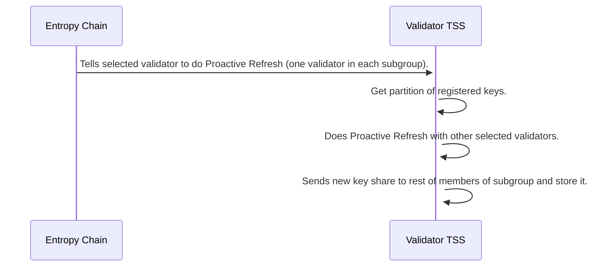

The idea here is that when validators join or leave the network, their key shares should become invalid. Every session, which consists of 2400 blocks (equivalent to 4 hours), the chain will notify the TSS (Threshold Signature Scheme) servers that a proactive refresh is taking place. The network's registered keys will be divided in parts to avoid refreshing the entire network and putting unnecessary strain on the validators. One TSS server from each sub-group is chosen based on a deterministic process involving the current block number modulo the number of TSS servers in that subgroup, similar to the selection process for DKG (Distributed Key Generation) during registration.

The selected TSS servers (one from each subgroup) will connect to each other and execute the proactive refresh protocol, generating a new set of key shares. This protocol is similar to the distributed key generation protocol used during registration. The selected TSS servers will send the new key shares to the other members of their subgroup. Upon receiving a new key share, the recipients will replace their existing key share in their key-value store with the new one. All previous key shares will be incompatible with the refreshed key shares. However, the public validating key of the distributed signing keypair never changes. The private access mode will have an individual trigger initiated by the user, although this feature has not been implemented yet.

