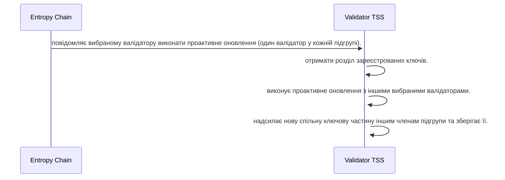

Ідея полягає в тому, що коли валідатори приєднуються або залишають мережу, їхні спільні ключі мають стати недійсними. Кожен сеанс, який складається з 2400 блоків (еквівалентно 4 годинам), ланцюг сповіщатиме сервери TSS (схема порогового підпису) про те, що відбувається проактивне оновлення. Зареєстровані ключі мережі будуть розділені на частини, щоб уникнути оновлення всієї мережі та непотрібного навантаження на валідатори. Один сервер TSS з кожної підгрупи вибирається на основі детерміністичного процесу, який включає поточний номер блоку за модулем кількості серверів TSS у цій підгрупі, подібно до процесу вибору для DKG (розподіленого генерування ключів) під час реєстрації.

Вибрані сервери TSS (по одному з кожної підгрупи) підключаться один до одного та виконають протокол проактивного оновлення, генеруючи новий набір спільних ключів. Цей протокол схожий на протокол генерації розподілених ключів, який використовується під час реєстрації. Вибрані сервери TSS надішлють нові спільні ключі іншим членам своєї підгрупи. Після отримання нової частки ключа одержувачі замінять наявну частку ключа у своєму сховищі ключів на нову. Усі попередні спільні ключі будуть несумісні з оновленими спільними ресурсами. Однак публічний ключ перевірки розподіленої пари ключів підпису ніколи не змінюється. Режим приватного доступу матиме індивідуальний тригер, ініційований користувачем, хоча ця функція ще не реалізована.

