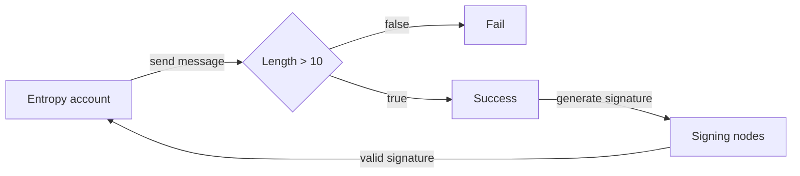

As a simple example, a program could be designed to check the length of a message. If the message is more than 10 characters, then the program returns `OK`, and the signing nodes create and return a valid signature to the account that submits the message. If the message is more than 10 characters, then the program fails, and no signature is created.


You can view a Rust implementation of this example in the [Entropy Programs GitHub repo](https://github.com/entropyxyz/programs/blob/master/examples/barebones/src/lib.rs).


## Requirements

Entropy programs are WebAssembly components that implement an Entropy-specific interface. The only function that a user must manually implement is `evaluate`, which takes the user's signature request as input and returns a success or an error. If no error is returned, then the message in the signature request will be signed using the program's corresponding key pair with the specified hashing algorithm.

### Program Configs

Programs can include a configuration which allows users to modify the `evaluation` behaviour without having to recompile and upload a new program to the chain. The format of this is undefined, allowing a configuration to be defined as a serialized C-compatible struct, UTF-8 JSON string, or anything in between.

### Auxiliary Data

Programs can require users to include auxiliary data, separate from the message, in their signature request.

### Oracle Data

Oracle data is information that can be grabbed by the chain and passed through to the program. This information comes from the pallet `Oracle` and storage slot `OracleData`. `OracleData` takes in a key which can denote any oracle data you want. Oracle data needs to come from the chain first as all programs need to be deterministic. 

All oracle data is scale encode to chain

Current headings 

| Key                   | Value                                       | Type    |
| --------------------- | ------------------------------------------- | ------- |
| block_number_entropy  | Stores the current block number of entropy  | u32     |

### Custom Hashing

As ECDSA schemes sign 256-bit numbers, programs can include a `custom_hash` function so users can utilize less common hashing functions. In its simplest form, the function converts a signature request (which also contains the message) into a 256-bit number.

### Limitations

#### Size

Compiled programs must be less than `1 MB`.

#### External data

Programs must be deterministic and cannot currently call other chains or directly access external data. However, developers can pass in auxiliary data, which can be obtained when the program is deployed.

#### Calling other programs

Programs cannot currently call other programs, however this is a planned feature. 

As a workaround, you can set a list of programs that are evaluated one after the other. For example:

1. Check a signature in the auxiliary data with the device key proxy program
2. Check that the message is an EVM transaction with the 'to' field matching an allow list with the ACL program.

#### Randomness

Programs cannot access the operating system's random number generator. 

If the program is not deterministic, it will cause issues because the nodes will only receive a signature if all TSS nodes involved in the signature request successfully evaluate the program. However, users can input random data into the program through the auxiliary data. Programs do not have access to the operating system's random number generator. If the program is non-deterministic, there will be problems, as the nodes will only get a signature if all TSS nodes involved in the signature request successfully evaluate the program. However, users can pass random data into the program through the auxiliary data.

## Upload Programs

Programs are written and compiled to WASM using the [entropyxyz/programs repository](https://github.com/entropyxyz/programs).

The workflow is as follows:

1. A program owner calls `set_program` in the program pallet with:
    - the program bytecode
    - the configuration interface, which is a serialized JSON object that allows a user to know the configuration of the program and then set their own individualized configuration in programsData
    - The signing key signs the transaction and becomes the deployer key
    - A reference counter gets set to 0 when uploading and is used to track how many users are using a program
2. A program then gets stored in the Programs storage slot with the key being `H(bytecode + configuration_interface)`. The hash is used by a user to point to the programs they want applied to their key. Every time a program is referenced, the reference counter increments
3. Since the key is a hash, there is no editing programs (since that would change the hash)
4. Programs can be removed if the ref count is zero by the deploy key

## Device-proxy

The device-proxy program is an Entropy program available at `0000000000000000000000000000000000000000000000000000000000000000`. Its main functionality is to:

1. Verify signatures based on the provided configuration and auxiliary data.
1. Check if a given public key is in the allowed set of keys (from the provided config).
1. Verify the generated signature against the provided message.
