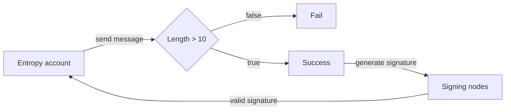

Як простий приклад, можна створити програму для перевірки довжини повідомлення. Якщо повідомлення містить більше ніж 10 символів, програма повертає «OK», а вузли підпису створюють і повертають дійсний підпис до облікового запису, який надсилає повідомлення. Якщо повідомлення містить більше 10 символів, програма не працює, і підпис не створюється.


Ви можете переглянути реалізацію Rust цього прикладу в [репозиторії програм Entropy GitHub](https://github.com/entropyxyz/programs/blob/master/examples/barebones/src/lib.rs).


## Вимоги

Програми Entropy — це компоненти WebAssembly, які реалізують специфічний для Entropy інтерфейс. Єдина функція, яку користувач повинен реалізувати вручну, це `evaluate`, яка приймає запит підпису користувача як вхідні дані та повертає успіх або помилку. Якщо помилка не повертається, повідомлення в запиті на підпис буде підписано за допомогою відповідної пари ключів програми з указаним алгоритмом хешування.

### Конфігурації програми

Програми можуть містити конфігурацію, яка дозволяє користувачам змінювати поведінку «оцінки» без необхідності перекомпілювати та завантажувати нову програму в ланцюжок. Формат цього не визначено, що дозволяє визначати конфігурацію як серіалізовану C-сумісну структуру, рядок JSON UTF-8 або щось середнє.

### Допоміжні дані

Програми можуть вимагати від користувачів включити допоміжні дані, окремі від повідомлення, у свій запит на підпис.

### Спеціальне хешування

Оскільки схеми ECDSA підписують 256-бітні числа, програми можуть містити функцію `custom_hash`, щоб користувачі могли використовувати менш поширені функції хешування. У своїй найпростішій формі функція перетворює запит на підпис (який також містить повідомлення) у 256-бітне число.

### Обмеження

#### Розмір

Розмір скомпільованих програм має бути менше 1 МБ.

#### Зовнішні дані

Програми мають бути детермінованими та не можуть наразі викликати інші ланцюжки чи отримувати прямий доступ до зовнішніх даних. Однак розробники можуть передати допоміжні дані, які можна отримати під час розгортання програми.

#### Виклик інших програм

Програми наразі не можуть викликати інші програми, однак це запланована функція.

Як обхідний шлях можна встановити список програм, які оцінюються одна за одною. Наприклад:

1. Перевірити підпис у допоміжних даних за допомогою проксі-програми ключа пристрою
2. Переконайтеся, що повідомлення є транзакцією EVM із полем «кому», яке відповідає списку дозволених програм у програмі ACL.

#### Випадковість

Програми не можуть отримати доступ до генератора випадкових чисел операційної системи.

Якщо програма не є детермінованою, це спричинить проблеми, оскільки вузли отримають підпис, лише якщо всі вузли TSS, залучені до запиту на підпис, успішно оцінять програму. Однак користувачі можуть вводити випадкові дані в програму через допоміжні дані. Програми не мають доступу до генератора випадкових чисел операційної системи. Якщо програма недетермінована, виникнуть проблеми, оскільки вузли отримають підпис, лише якщо всі вузли TSS, залучені до запиту на підпис, успішно оцінять програму. Однак користувачі можуть передавати випадкові дані в програму через допоміжні дані.

## Програми завантаження

Програми пишуться та компілюються в WASM за допомогою [репозиторію entropyxyz/programs](https://github.com/entropyxyz/programs).

Робочий процес такий:

1. Власник програми викликає `set_program` у панелі програм за допомогою:
 - байт-код програми
 - інтерфейс конфігурації, який є серіалізованим об’єктом JSON, який дозволяє користувачеві знати конфігурацію програми, а потім установлювати власну індивідуальну конфігурацію в programsData
 - Ключ підпису підписує транзакцію та стає ключем розгортача
 - Під час завантаження лічильник посилань встановлюється на 0 і використовується для відстеження кількості користувачів, які використовують програму
2. Потім програма зберігається в слоті для зберігання програм із ключем `H(bytecode + configuration_interface)`. Хеш використовується користувачем для вказівки на програми, які він хоче застосувати до свого ключа. При кожному посиланні на програму лічильник посилань збільшується
3. Оскільки ключ є хешем, немає програм для редагування (оскільки це змінило б хеш)
4. Програми можна видалити, якщо кількість посилань дорівнює нулю ключем розгортання

## Проксі пристрою

Програма пристрою-проксі є програмою Entropy, доступною за адресою `00000000000000000000000000000000000000000000000000000000000000000`. Його основна функція:

1. Перевірити підписи на основі наданої конфігурації та допоміжних даних.
1. Перевірте, чи даний відкритий ключ знаходиться в дозволеному наборі ключів (з наданої конфігурації).
1. Звірте згенерований підпис із наданим повідомленням.
