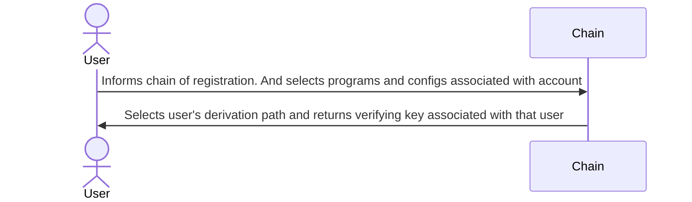

The SDK method for registering is [`Entropy.register`](https://github.com/entropyxyz/sdk/blob/main/README.md#register).

## The registering process



1. The user registers with the Entropy chain by submitting a transaction from any account containing the 'Account Key', and initial 'ProgramsData'. 
    * ```ProgramsData``` - Is multiple Programs Instances. Which contain the ```program_pointer``` (the hash of the program you want to use) and the ```program_config``` for that program. On the evaluation of a signature request a threshold server will run all the programs and pass through the program config for that program.

1. The chain selects a derivation path based on a running count and stores said user information in a mapping with the veryfying key for that user as the key in the mapping. The veryfying key will be the account that the edcsa signatures resolve to. 
