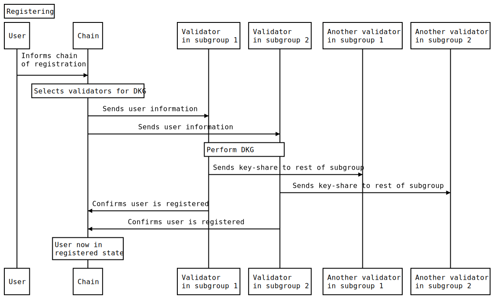

The SDK method for registering is [`Entropy.register`](https://github.com/entropyxyz/sdk/blob/main/README.md#register).

## The registering process



1. The user registers with the Entropy chain by submitting a transaction from the 'signature request account' containing the 'Account Key', initial 'ProgramsData', and chosen [access mode](). 
    * ```ProgramsData``` - Is multiple Programs Instances. Which contain the ```program_pointer``` (the hash of the program you want to use) and the ```program_config``` for that program. On the evaluation of a signature request a threshold server will run all the programs and pass through the program config for that program.

1. The chain selects which nodes should perform a [distributed key generation (DKG)](https://docs.rs/synedrion/latest/synedrion/sessions/fn.make_key_gen_session.html) based on the current block number.
1. As each block is finalized, an off-chain worker makes an HTTP POST request to each selected threshold server with the signature request accounts of all users who have registered, as well as details of the other validator nodes in the signing subgroup. Specifically, the `/user/new` ([src](https://github.com/entropyxyz/entropy-core/blob/master/crypto/server/src/user/api.rs) [API](https://docs.rs/entropy-tss/latest/entropy_tss/#usernew---post)) endpoint is called with a [`OcwMessageDkg`](https://docs.rs/entropy-shared/latest/entropy_shared/types/struct.OcwMessageDkg.html).
1. All selected threshold servers:
    1. Connect to each other over websocket and make a [noise handshake](https://noiseprotocol.org/noise.html) to establish an encrypted channel for protocol messages.
    1. Perform a [DKG](https://docs.rs/synedrion/latest/synedrion/sessions/fn.make_key_gen_session.html) and store their [key-share](https://docs.rs/synedrion/latest/synedrion/struct.KeyShare.html) in their [encrypted key-value store](https://docs.rs/entropy-kvdb).
    1. Send the generated share to other members of their signing subgroup by POSTing to `/user/receive_key` ([src](https://github.com/entropyxyz/entropy-core/blob/master/crates/threshold-signature-server/src/user/api.rs) [API](https://docs.rs/entropy-tss/latest/entropy_tss/#for-other-instances-of-the-threshold-server)).
    1. They submit a transaction to the entropy chain to confirm the user has successfully registered.
1. On receiving a key-share via `receive_key`, the threshold server will check with the chain that the sender is in the correct subgroup, and if so store the key-share in their key-value store.
1. On receiving a confirmation transaction from all selected threshold server, the chain sets the user to a 'registered' state, making it possible to sign messages. 
