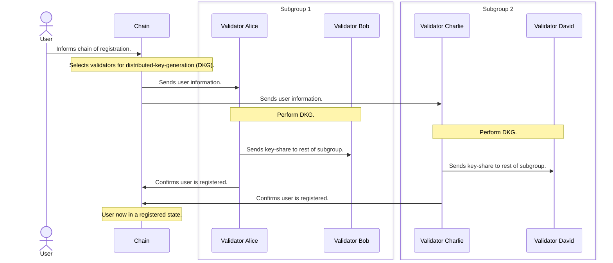

Метод SDK для реєстрації — [`Entropy.register`](https://github.com/entropyxyz/sdk/blob/main/README.md#register).

## Процес реєстрації



1. Користувач реєструється в ланцюжку Entropy, надсилаючи транзакцію з «облікового запису запиту на підпис», що містить «Ключ облікового запису» та початкові «ProgramsData».

    - ```ProgramsData``` – кілька екземплярів програм. Які містять ```program_pointer``` (хеш програми, яку ви хочете використовувати) і ```program_config``` для цієї програми. Після оцінки запиту на підпис пороговий сервер запускатиме всі програми та проходитиме конфігурацію програми для цієї програми.

1. Ланцюжок вибирає, які вузли мають виконувати [генерацію розподіленого ключа (DKG)](https://docs.rs/synedrion/latest/synedrion/sessions/fn.make_key_gen_session.html) на основі поточного номера блоку.
1. Після завершення кожного блоку робочий пристрій поза мережею робить запит HTTP POST до кожного вибраного порогового сервера з обліковими записами запитів підпису всіх користувачів, які зареєструвалися, а також відомостями про інші вузли перевірки в підгрупі підпису. Зокрема, `/user/new` ([src](https://github.com/entropyxyz/entropy-core/blob/master/crypto/server/src/user/api.rs) [API](https: //docs.rs/entropy-tss/latest/entropy_tss/#usernew---post)) кінцева точка викликається за допомогою [`OcwMessageDkg`](https://docs.rs/entropy-shared/latest/entropy_shared/types /struct.OcwMessageDkg.html).
1. Усі вибрані порогові сервери:
 1. Підключіться один до одного через websocket і встановіть [шумове рукостискання](https://noiseprotocol.org/noise.html), щоб установити зашифрований канал для повідомлень протоколу.
 1. Виконайте [DKG](https://docs.rs/synedrion/latest/synedrion/sessions/fn.make_key_gen_session.html) і збережіть їх [спільний доступ](https://docs.rs/synedrion/latest /synedrion/struct.KeyShare.html) у їхньому [зашифрованому сховищі ключ-значення](https://docs.rs/entropy-kvdb).
 1. Надішліть згенерований спільний доступ іншим членам їхньої підгрупи підпису, надіславши POST до `/user/receive_key` ([src](https://github.com/entropyxyz/entropy-core/blob/master/crates/threshold-signature) -server/src/user/api.rs) [API](https://docs.rs/entropy-tss/latest/entropy_tss/#for-other-instances-of-the-threshold-server)).
 1. Вони надсилають транзакцію в ланцюжок ентропії, щоб підтвердити успішну реєстрацію користувача.
1. Отримавши спільний ключ через `receive_key`, пороговий сервер перевірить у ланцюжку, чи належить відправник до правильної підгрупи, і якщо так, збереже спільний ключ у своєму сховищі ключ-значення.
1. Отримавши підтвердження транзакції від усіх вибраних порогових серверів, ланцюжок встановлює користувача в «зареєстрований» стан, що робить можливим підписувати повідомлення.
