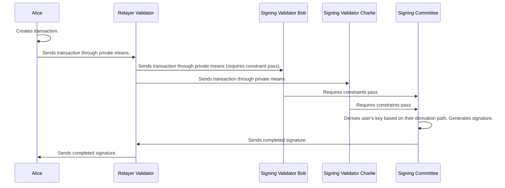

## Signing process

1. The user computes the message they wish to sign and selects a Relayer node to send their message to `/user/relay_tx`. A relayer node is a validator that is not a signer 
1. The relayer nodes does some checks, then randomly selects T of the signing commitee to pass the message to.
1. The Relayer contacts all threshold servers in the signing committee and makes a POST to `/user/sign_tx` with the message to be signed (encrypted for that node). 
1. On receiving a message, each node checks that it is a member of the signing committee and is being contactacted by a validator.
1. The Threshold server retrieves the latest version of the associated program from the entropy chain, and executes it with the message to be signed as input. Only on getting successful program output do they continue to the next step (this is also done by the relayer before relaying a message).
1. The Threshold server sets up websocket connections to or from the rest of the committee to use for threshold signing protocol messages. They decide whether to make an outgoing connection, or accept an incoming one by comparing account IDs. These connections are secured using the [noise protocol](https://noiseprotocol.org/noise.html). Signing protocol messages can be either 'broadcast' to all of the committee or 'p2p' to a specific member.
1. Once all members of the signing committee have subscribed, nodes participate in the signing protocol to produce a signature using the key-shares retrieved from their key-value store.
1. If the signing process fails, nodes broadcast who the malicious/faulty signer was, which is included in the next block. Following that, the next block contains details of a new signing committee. The misbehaving signer will be 'slashed' (not yet implemented).
1. If the process is successful, the signature is returned to the relayer then the user.

The signing process can only take place when a user is already registered on Entropy. The process involves the user and a committee of validators collectively performing the signing. The current version of the program will be executed here to determine whether or not to proceed with the signing protocol.

For details on how signatures are actually created, see [Threshold Signature Scheme]().

## Messages

Currently the only restrictions for a message is that it's content is less than `1 MB` in size.
