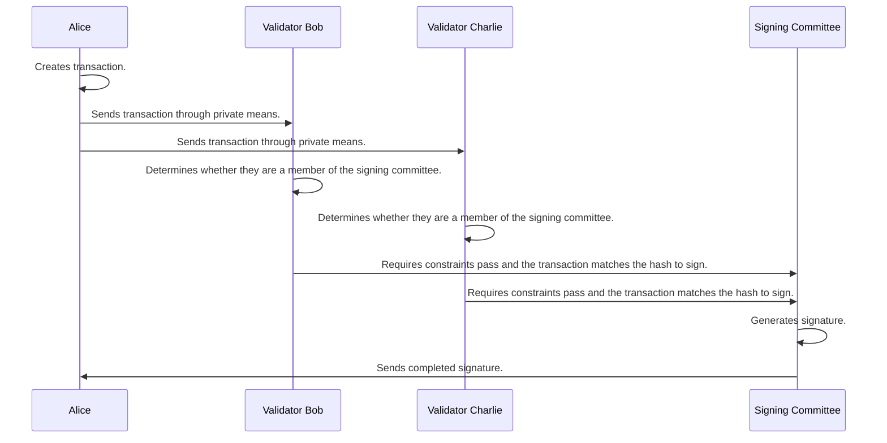

## Signing process

1. The user computes the hash of the message they wish to sign and selects a signing committee by deterministically selecting a member of each signing group based on this hash. They can get the details of the signing groups as they were published on-chain when the user [registered]().
1. The user contacts all threshold servers in the signing committee and makes a POST to `/user/sign_tx` with the message to be signed (encrypted for that node). 
1. On receiving a message, each node checks that it is a member of the signing committee for that message using the hash.
1. The Threshold server retrieves the latest version of the associated program from the entropy chain, and executes it with the message to be signed as input. Only on getting successful program output do they continue to the next step.
1. The Threshold server sets up websocket connections to or from the rest of the committee to use for threshold signing protocol messages. They decide whether to make an outgoing connection, or accept an incoming one by comparing account IDs. These connections are secured using the [noise protocol](https://noiseprotocol.org/noise.html). Signing protocol messages can be either 'broadcast' to all of the committee or 'p2p' to a specific member.
1. Once all members of the signing committee have subscribed, nodes participate in the signing protocol to produce a signature using the key-shares retrieved from their key-value store.
1. If the signing process fails, nodes broadcast who the malicious/faulty signer was, which is included in the next block. Following that, the next block contains details of a new signing committee. The misbehaving signer will be 'slashed' (not yet implemented).
1. If the process is successful, the signature is returned to the user. Currently, this requires the user to repeatedly poll POST `signer/signature` with the signature hash until it successfully retrieves a signature.

The signing process can only take place when a user is already registered on Entropy. The process involves the user and a committee of validators collectively performing the signing. The committee requires one Validator from each signing group as well as the user. The current version of the program will be executed here to determine whether or not to proceed with the signing protocol.

For details on how signatures are actually created, see [Threshold Signature Scheme]().

## Signing Group Selection

Signing groups are chosen and held on-chain. Every time a new validator joins or gets removed, the chain will place or remove them from a subgroup such that:
  - Subgroups do not shuffle current validators.
  - Subgroups remain the same size or off by one.

## Messages

Currently the only restrictions for a message is that it's content is less than `1 MB` in size.
