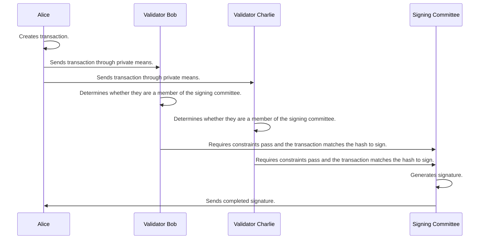

## Процес підписання

1. Користувач обчислює хеш повідомлення, яке він бажає підписати, і вибирає комітет підписання шляхом детермінованого вибору члена кожної групи підписання на основі цього хешу. Вони можуть отримати відомості про групи підписання, оскільки вони були опубліковані в мережі, коли користувач [реєструвався]().
1. Користувач зв’язується з усіма пороговими серверами в комітеті підписання та надсилає POST до `/user/sign_tx` із повідомленням, яке потрібно підписати (зашифроване для цього вузла).
1. Отримавши повідомлення, кожен вузол перевіряє, чи є він членом комітету підписання цього повідомлення за допомогою хешу.
1. Сервер Threshold отримує останню версію пов’язаної програми з ланцюжка ентропії та виконує її з повідомленням, яке має бути підписане як вхідні дані. Лише після отримання успішних результатів програми вони переходять до наступного кроку.
1. Сервер Threshold встановлює підключення через веб-сокет до решти комітету або від нього для використання для повідомлень протоколу порогового підпису. Вони вирішують, чи робити вихідне з’єднання, чи приймати вхідне, порівнюючи ідентифікатори облікових записів. Ці з’єднання захищені за допомогою [протоколу шуму](https://noiseprotocol.org/noise.html). Повідомлення протоколу підписання можуть бути «широкомовними» для всього комітету або «p2p» для певного члена.
1. Після того, як усі члени комітету підписання підписалися, вузли беруть участь у протоколі підписання для створення підпису, використовуючи спільні ключі, отримані з їхнього сховища ключ-значення.
1. Якщо процес підписання не вдається, вузли транслюють, хто був зловмисним/несправним підписувачем, що включено до наступного блоку. Після цього наступний блок містить деталі нового комітету підписання. Підписувач, який не поведе себе, буде «порізано» (ще не реалізовано).
1. Якщо процес проходить успішно, підпис повертається користувачеві. Наразі це вимагає від користувача неодноразового опитування POST `підписувача/підпису` з хешем підпису, доки він успішно не отримає підпис.

Процес підписання може відбуватися лише тоді, коли користувач уже зареєстрований на Entropy. У цьому процесі беруть участь користувач і комітет валідаторів, які спільно виконують підписання. Комітет вимагає одного валідатора від кожної групи підпису, а також користувача. Поточна версія програми буде виконана тут, щоб визначити, чи слід продовжувати протокол підписання.

Докладніше про те, як фактично створюються підписи, див. [Схема порогового підпису]().

## Вибір групи підписів

Групи підписання вибираються та утримуються в ланцюжку. Кожного разу, коли новий валідатор приєднується або його видаляють, ланцюжок поміщає або видаляє його з підгрупи так, щоб:
 - Підгрупи не перемішують поточні валідатори.
 - Підгрупи залишаються однакового розміру або змінюються на одиницю.

## Повідомлення

Наразі єдине обмеження для повідомлення полягає в тому, що його вміст має розмір менше 1 МБ.
