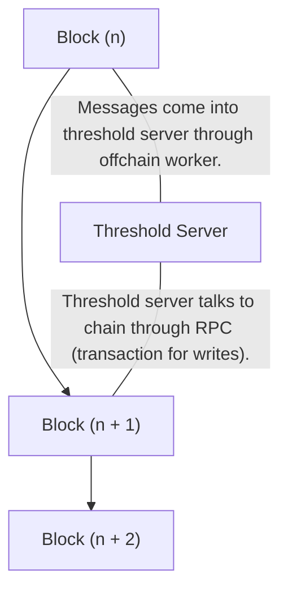

- Блокчейн Entropy створено за допомогою [Substrate](https://docs.substrate.io/). Це обробляє загальнодоступні дані про те, хто є користувачами та які програми вони використовують, хто є валідаторами та до якої «підгрупи підпису» вони належать, а також байт-код усіх доступних програм.
- [Сервер підписів Threshold](https://github.com/entropyxyz/entropy-core/tree/master/crates/threshold-signature-server), який має HTTP API на основі [Axum](https://docs .rs/axum). Це обробляє приватні дані, наприклад спільні ключі підпису користувача, і запускає протокол підпису.

## Ланцюжок ентропії [src](https://github.com/entropyxyz/entropy-core/tree/master/node/cli)

Мета блокчейну Entropy полягає в тому, щоб мати «єдине джерело правди» для інформації, яка має бути загальнодоступною та щодо якої порогові сервери підписів повинні мати консенсус. Наприклад, нам потрібно домовитися про те, які валідатори належать до яких підписуючих підгруп і які підгрупи братимуть участь у підписанні конкретного повідомлення.

### Загальні функції від Substrate

- Використовує **[алгоритм консенсусу BABE](https://research.web3.foundation/en/latest/polkadot/block-production/Babe.html)** (сліпе призначення для розширення Blockchain). Короткий опис BABE:
 - Час поділено на «епохи», які складаються з серії «слотів» для кожного блоку, який буде опубліковано.
 - Блок генезису містить випадкове значення, яке визначає, які вузли вироблятимуть блоки протягом перших двох «епох». Після цього кожна епоха використовує «випадковість» двох епох тому у своєрідній «лотереї», використовуючи «перевірену випадкову функцію», щоб вирішити, чи може даний вузол створювати блок для даного слота.
 - У деяких слотах не вибрано виробника блоків - у цьому випадку виробник вибирається іншим алгоритмом вибору - "круговим".
 — У деяких слотах вибрано кілька виробників блоків — у цьому випадку всі вибрані вузли створюють блок, і відбувається «перегони» між розгалуженнями, а протокол фіналізації визначає, який збережеться.
- Остаточність визначається **[Grandpa](https://github.com/w3f/consensus/blob/master/pdf/grandpa.pdf)** (Угода про рекурсивний префікс ANcestor на основі GHOST). Остаточність — це процес, за допомогою якого мережа погоджується, що блок ніколи не буде скасовано.
- Середовище виконання блокчейну компілюється в WASM, що дозволяє публікувати оновлення в ланцюжку та виконувати їх автоматично, не вимагаючи жорсткого розгалуження.
- Вузли виявляють один одного через [libp2p kademlia DHT](https://github.com/libp2p/specs/blob/master/kad-dht/README.md).

### Настроювані функції, специфічні для Entropy:

- **Палет розширення розбивки** [src](https://github.com/entropyxyz/entropy-core/blob/master/pallets/staking/src/lib.rs) - розбивка розширена для призначення певного граничного підпису Сервери обліковуються на певному вузлі ланцюга та відстежують, до якої підгрупи підпису вони належать.
- **Палетка реєстру** [src](https://github.com/entropyxyz/entropy-core/blob/master/pallets/registry/src/lib.rs) - тут надається реєстр користувачів Entropy і програм зараз пов’язано з їхнім обліковим записом. Для цього використовуються [події] Substrate (https://docs.substrate.io/build/events-and-errors).
- **Палет програм** [src](https://github.com/entropyxyz/entropy-core/blob/master/pallets/programs/src/lib.rs) - Тут зберігається байт-код програми, а також метадані, пов’язані з програму, як-от опис її інтерфейсу та кількість її використання.

## Сервер підпису Threshold [src](https://github.com/entropyxyz/entropy-core/tree/master/crates/threshold-signature-server) [API](https://docs.rs/entropy- tss) Це частина, яка виконує протокол порогового підпису разом з іншими примірниками сервера порогового підпису. Він має зашифроване сховище ключ-значення, яке використовується для приватної інформації, де консенсус не потрібен. Оскільки пороговий сервер підписів має справу з приватними даними, які ніколи не повинні бути відкритими в мережі, він поширюється як окремий двійковий файл. Він також обробляє генерацію розподілених ключів і протоколи проактивного оновлення.

Він має такі особливості:

- **Клієнт підпису** [src](https://github.com/entropyxyz/entropy-core/tree/master/crates/threshold-signature-server/src/signing_client), який обробляє слухачів для різних сеансів протоколу . Транспортування протоколу обробляється ящиком **entropy-protocol** [src](https://github.com/entropyxyz/entropy-core/tree/master/crates/protocol) [API](https://docs.rs/entropy-protocol), який запускає [ThresholdSignaureScheme].
- **Зашифроване сховище ключ-значення** [src](https://github.com/entropyxyz/entropy-core/tree/master/crypto/kvdb) [API](https://docs.rs/entropy -kvdb) для ключових спільних ресурсів та інших секретних даних, які надає користувач. Створено за допомогою [sled](https://docs.rs/sled/latest/sled).
- Виконує [programs]() - після чого приймається рішення щодо участі в підписанні даного повідомлення.
- **[HTTP API](https://docs.rs/entropy-tss/latest/entropy_tss/#the-http-endpoints)** для зв’язку з користувачами, вузлом ланцюжка ентропії та іншими пороговими серверами .
- Обліковий запис для надсилання зовнішніх (транзакцій) до ланцюга Entropy. Наприклад, коли протокол генерації розподіленого ключа успішно працює під час реєстрації користувача, кожен сервер TSS надсилає підтвердження до ланцюжка, надсилаючи транзакцію.

### Використання

`entropy-tss` є членом робочої області `entropy-core`. Коли ви запускаєте `entropy-tss`, вас запитають пароль
використовується для шифрування сховища ключ-значення.

Майте на увазі, що неможливо відновити цей пароль, якщо ви його втратите.

База даних зберігається в каталозі `.entropy`, який створюється в поточному робочому каталозі, де виконується двійковий файл. Ви можете видалити цей каталог, якщо вам потрібно «почати заново» під час розробки.

Якщо `entropy-tss` скомпільовано з увімкненою функцією `unsafe`, деякі додаткові маршрути HTTP будуть доступні. Вони призначені лише для тестування та розробки та забезпечують прямий доступ до сховища ключ-значення.

Якщо вам це потрібно, побудуйте з:

`cargo build -p entropy-tss --release --features unsafe`
