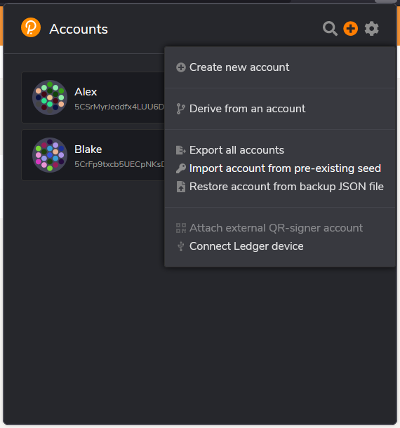
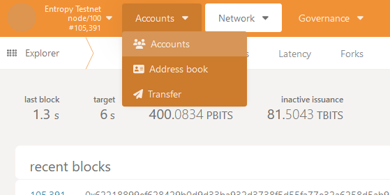
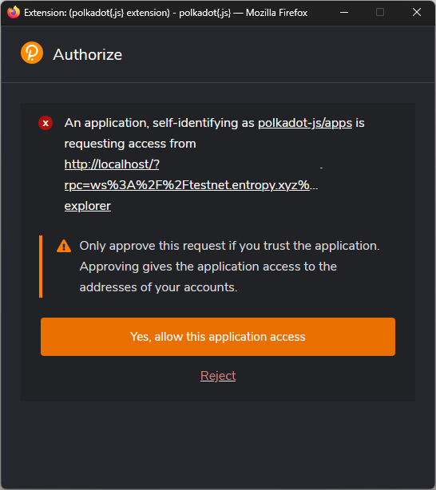
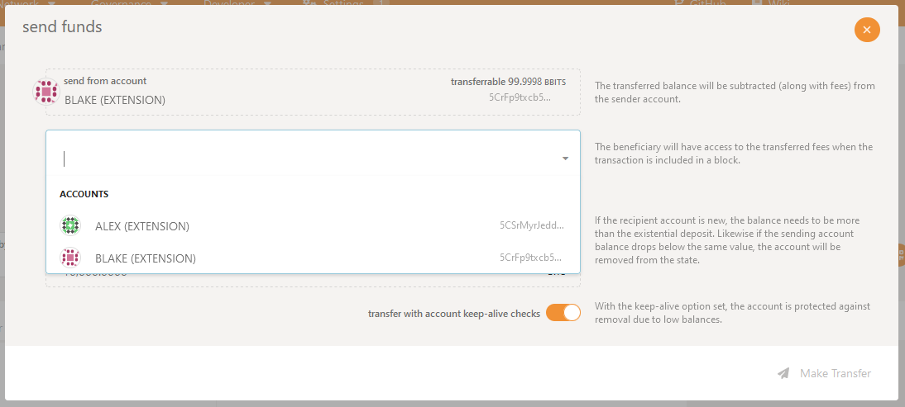
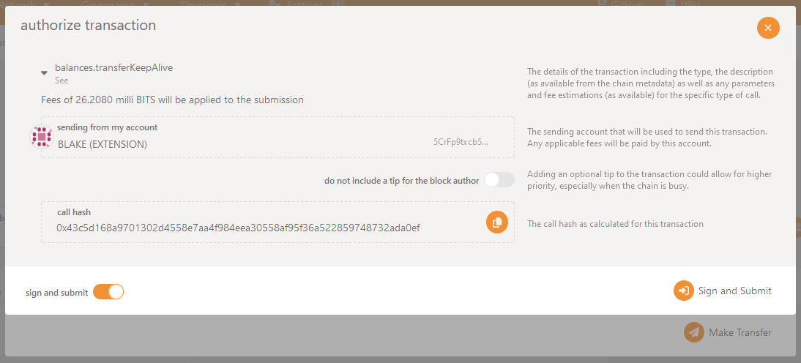

If you're unsure which process to follow, the [Substrate Explorer]() workflow is the easiest.

## Substrate explorer

### Prerequisites

To transfer funds, you must have the following:

- Access to at least 2 [Entropy accounts](), one of which must have funds.
- Access to the [Polkadot.js explorer]().
- A Polkadot.js compatible browser wallet. This guide uses the [Polkadot.js Browser Extension](https://polkadot.js.org/extension/) as an example.

### Steps

1. Import the addresses into the wallet. In the Polkadot\{.js\} Browser Extension, this can be done by selecting the plus **+** icon and clicking **Import account from pre-existing seed**:

   

1. Start the Substrate explorer and connect to the `testnet.entropy.xyz:9944` network.
1. Select the **Accounts** dropdown and click **Accounts**.

   

1. A popup should display asking if you want to grant the Substrate Explorer access to your wallet. Click **Yes, allow this application access**.

   

1. Click **Send** on the account that you want to send funds _from_.
1. Select the account you want to send funds _to_ in the **send to address** dropdown.

   

1. Enter the number of tokens you want to send. The minimum number you can send is `10000`.
1. Click **Make Transfer**.
1. Review the details on this confirmation page and click **Sign and Submit**.

   

That's it! The transaction will take up to 6 seconds to transfer funds from one account to another.

## Interactive CLI

Here is the process for transfering using the Entropy CLI's interactive text-based user interface (TUI).

1. Start the TUI:

    ```shell
    entropy
    ```

1. From the main menu in the CLI select **Manage Accounts**:

    ```output
    ? Select Action
    ❯ Manage Accounts
      Balance
      Register
      Sign
      Transfer
      Deploy Program
      User Programs
      Exit
    ```

1. Choose **Select Accounts**.
1. Select the account you want to transfer funds _from_.
1. Return to the main menu.
1. Select **Transfer**.
1. Enter the amount of funds you want to transfer.
1. Enter the address that you want to transfer funds _to_.

The transfer should take about 10 seconds.

## Programmatic CLI

Here is the process for transfering using the Entropy CLI's programmatic interface. This method can be use within script.

1. Ensure that the CLI is installed properly:

    ```shell
    entropy --version
    ```

    ```output
    v0.1.1
    ```

1. Decide which account you want to send funds _from_. If you only have one account within the Entropy CLI, the CLI will automatically use that account to send funds from.

    If you have more than one account within the CLI, you must specify which account to send funds from. You can list your accounts with `entropy account list`. Adding `| jq` is optional, but will make the JSON output easier to read:

    ```shell
    entropy account list | jq
    ```

    ```output
    [
      {
        "name": "Andre",
        "address": "5D77qPQj7S346ocxgHX7XmYUqtQft4ghXBYBuv8HuznDgDm7",
        "verifyingKeys": []
      },
      {
        "name": "Yoel",
        "address": "5EJTUTyZnffSdVc7dCVTKKkNmpXUW5MocmtspZXUk7X1CF7M",
        "verifyingKeys": []
      }
    ]
    ```

1. Initiate the transfer by supplying the destination address and amount to `entropy transfer`. If you have multiple accounts and you want to send funds from a specific account, add the `--account` option, followed by the name of the outbound account:

    ```shell
    entropy transfer --account Andre 5EJTUTyZnffSdVc7dCVTKKkNmpXUW5MocmtspZXUk7X1CF7M 1
    ```

    ```output
    TODO: Receiving an error here. Need to wait for https://github.com/entropyxyz/cli/issues/321 before fixing.
    ```
