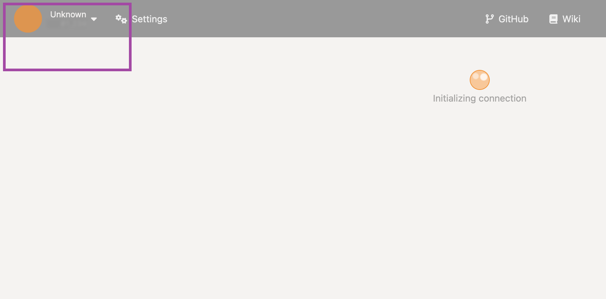
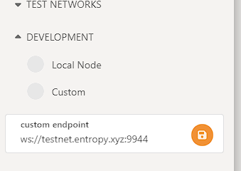
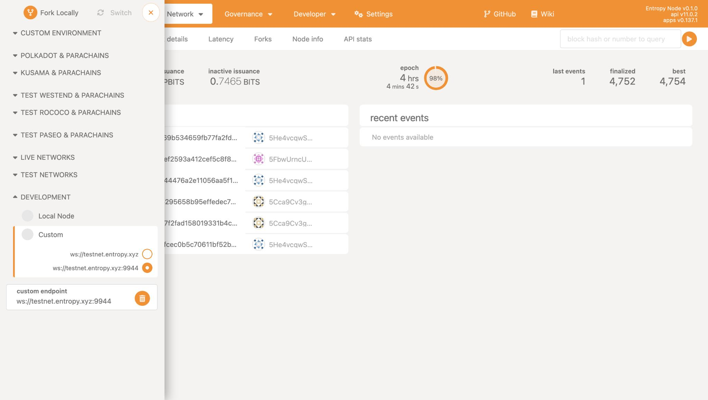

The [Polkadot\{.js\} Apps](https://polkadot.js.org/apps) is a popular user interface for interacting with Substrate blockchains. Since Entropy is built using Substrate, we can use this explorer to search and view chain data on the Entropy network.

## Public interface


**Quick hint**: You can jump straight to the explorer with this link: [polkadot.js.org/apps/?rpc=wss%3A%2F%2Ftestnet.entropy.xyz](https://polkadot.js.org/apps/?rpc=wss%3A%2F%2Ftestnet.entropy.xyz)


The fastest way to view information about the Entropy blockchain is to visit the public Polkadot\{.js\} interface.

1. Go to [polkadot.js.org/apps](https://polkadot.js.org/apps/#/explorer)
1. Click the network dropdown at the top left of the screen.

    

1. In the sidebar, select the **Development** dropdown.
1. Within the **custom endpoint** field, enter the address for the network you want to connect to:

   ```plaintext
   wss://testnet.entropy.xyz
   ```

1. Click the **Save** icon next to the address field.
1. You should now be able to use the Polkadot\{.js\} interface with Entropy.

## Local install

If you don't want to use the public web interface, you can spin up a local copy of the Polkadot\{.js\} explorer.

### Prerequisites

- [Docker](https://docker.com)

### Run the explorer

1. Open a terminal window and run:

   ```shell
   docker run --rm -it --name polkadot-ui -e WS_URL=ws://testnet.entropy.xyz:9944 -p 80:80 jacogr/polkadot-js-apps:latest
   ```

   This command will start a background process.

1. Open a browser and go to `http://localhost`.

### Connect to the Entropy network

1. With the explorer running, select the **Unknown** dropdown at the top left:

   

1. In the sidebar, select the **Development** dropdown.
1. Within the **custom endpoint** field, enter the address for the network you want to connect to:

   ```plaintext
   ws://testnet.entropy.xyz:9944
   ```

1. Click the **Save** icon next to the address field.

   

1. The block explorer should start populating with details from the Entropy network:

   

You should now be able to use the block explorer as usual. Check out the [wiki](https://wiki.polkadot.network/) for what information you can get from this blockchain explorer.
