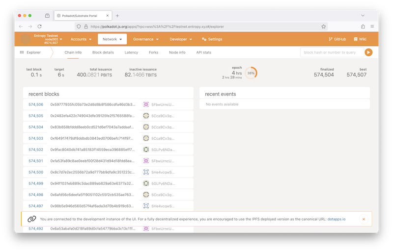
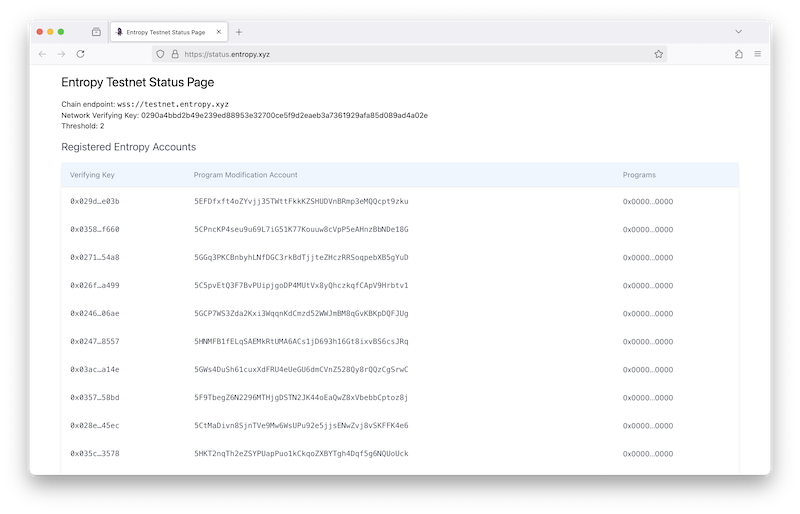
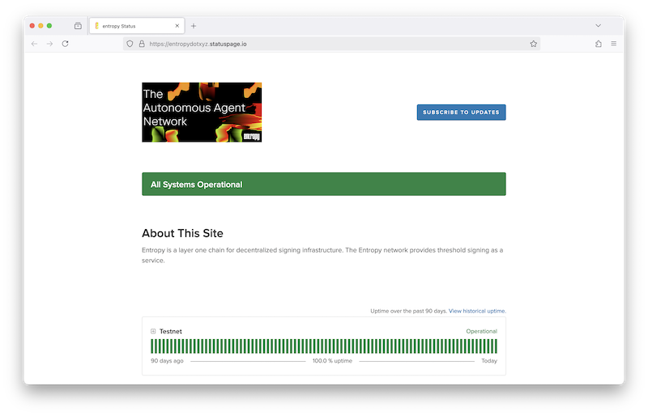

## Polkadot Chain Explorer

[polkadot.js.org/apps](https://polkadot.js.org/apps/?rpc=wss%3A%2F%2Ftestnet.entropy.xyz#/explorer)

A one-size-fits-all blockchain explorer for Substrate-based chains, built by the [Polkadot.js team](https://polkadot.js.org/).

## Testnet Status

[status.entropy.xyz](https://status.entropy.xyz/)

A constantly updated list of registered accounts, programs, and validators.

## Uptime

[uptime.entropy.xyz](https://entropydotxyz.statuspage.io/)

The home of Entropy's real-time and historical data on system performance.
