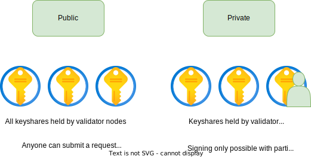

# Access Modes

Entropy accounts can have two distinct access modes.

With _public_ access mode, anyone can submit a request to sign a message. However, the account may be configured with a program that restricts who can sign messages or has rules about what kinds of messages different users may sign. Data, such as a signature from the user, may be passed in as auxiliary data to the program. For example, an organization whose members change over time could use public access where signing rules are defined in a program, and the program could be updated whenever the status of group members changes. Adding these constraints to an account are available in every access mode, not just public access.

With _private_ access mode, the users themselves hold a key share and participate in the distributed key generation and signing protocols. This is the most secure mode, as it is impossible for the TSS servers to collude against the user. However, it requires that the user safeguard their key share and requires more complicated UX.
