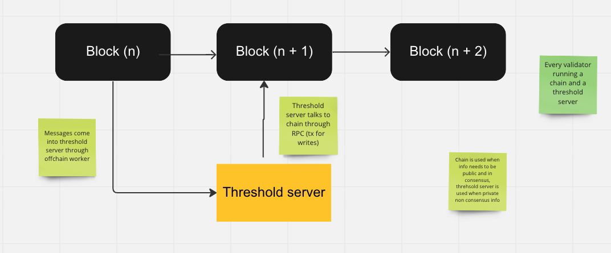

[`entropy-core`](https://github.com/entropyxyz/entropy-core) is run by validator nodes in the Entropy network. It has two different binaries, both of which are run by each validator node:

- The Entropy blockchain is built with [Substrate](https://docs.substrate.io/). This handles public data relating to who the users are and which programs they use, who the validators are and which 'signing subgroup' they belong to, and the bytecode of all available programs.
- The [Threshold signature server](https://github.com/entropyxyz/entropy-core/tree/master/crates/threshold-signature-server) which has an HTTP API based on [Axum](https://docs.rs/axum). This handles private data, such as a user's signing key shares, and runs the signing protocol.

## The Entropy chain [src](https://github.com/entropyxyz/entropy-core/tree/master/node/cli)

The purpose of the Entropy blockchain is to have a 'single source of truth' for the information which needs to be public and which the threshold signature servers need to have consensus on. For example, we need to have agreement of which validators belong to which signing subgroups, and which subgroups will participate in signing a particular message.

### General functionality from Substrate / Polkadot:

- Uses the **[BABE consensus algorithm](https://research.web3.foundation/en/latest/polkadot/block-production/Babe.html)** (Blind Assignment for Blockchain Extension). A brief description of BABE:
  - Time is divided into 'epochs', which consist of a series of 'slots' for each block that will be published.
  - The genesis block contains a random value that determines which nodes will produce blocks during the first two 'epochs'. After that, each epoch uses 'randomness' from two epochs ago in a kind of 'lottery', using a 'verifiable random function' to decide whether a given node may produce a block for a given slot.
  - Some slots have no block producer chosen - in which case a producer is chosen by another selection algorithm - 'round robin'.
  - Some slots have several block producers chosen - in which case all chosen nodes produce a block and there is a 'race' between forks, and the finalisation protocol determines which is kept.
- Finality is determined by **[Grandpa](https://github.com/w3f/consensus/blob/master/pdf/grandpa.pdf)** (GHOST-based Recursive ANcestor Deriving Prefix Agreement). Finality is the process by which the network agrees that a block will never be reverted.
- The blockchain runtime compiles to WASM, which allows updates to be published on-chain and carried out automatically without requiring hard forking.
- Nodes discover each other via [libp2p's kademlia DHT](https://github.com/libp2p/specs/blob/master/kad-dht/README.md).

### Custom functionality specific to Entropy:

- **Staking extension pallet** [src](https://github.com/entropyxyz/entropy-core/blob/master/pallets/staking/src/lib.rs) - staking is extended to assign a particular Threshold Signature Servers account to a particular chain node, and tracks which signing subgroup they belong to.
- **Registry pallet** [src](https://github.com/entropyxyz/entropy-core/blob/master/pallets/registry/src/lib.rs) - This provides a registry of Entropy users and which programs are currently associated with their account. This uses Substrate [events](https://docs.substrate.io/build/events-and-errors).
- **Programs pallet** [src](https://github.com/entropyxyz/entropy-core/blob/master/pallets/programs/src/lib.rs) - This stores program bytecode as well as metadata associated with the program, such as a description of its interface and how many times it is used.

## The Threshold Signature Server [src](https://github.com/entropyxyz/entropy-core/tree/master/crates/threshold-signature-server) [API](https://docs.rs/entropy-tss)

This is the part that carries out the threshold signing protocol, together with other instances of the threshold signature server. It has an encrypted key-value store used for private information where consensus is not required. Since the threshold signature server deals with private data that must never be exposed publicly on-chain, it is distributed as a separate binary. It also handles the distributed key generation and proactive-refresh protocols.

It has the following features:

- The **signing client** [src](https://github.com/entropyxyz/entropy-core/tree/master/crates/threshold-signature-server/src/signing_client) which handles listeners for the different protocol sessions. The protocol transport is handled by the **entropy-protocol** crate [src](https://github.com/entropyxyz/entropy-core/tree/master/crates/protocol) [API](https://docs.rs/entropy-protocol), which runs the [ThresholdSignaureScheme].
- An **encrypted key-value store** [src](https://github.com/entropyxyz/entropy-core/tree/master/crypto/kvdb) [API](https://docs.rs/entropy-kvdb) for key shares and other secret data, which are submitted by the user. Built with [sled](https://docs.rs/sled/latest/sled).
- Executes [programs](./program-features) - upon which a decision is made as to whether to participate in signing a given message.
- An **[HTTP API](https://docs.rs/entropy-tss/latest/entropy_tss/#the-http-endpoints)** for communication with users, with the entropy chain node, and with other threshold servers.
- An account for submitting extrinsic (transactions) to the Entropy chain. For example, when the distributed key generation protocol runs successfully during user registration, each TSS server sends a confirmation to the chain by submitting a transaction.

### Usage

`entropy-tss` is a member of the `entropy-core` workspace. When you run `entropy-tss`, you will be asked for a password
used to encrypt the key-value store.

Be aware there is no way to recover this password if you lose it.

The database is stored in the `.entropy` directory, which is created in the current working directory where the binary is run. You can remove this directory if you need to 'start fresh' during development.

If `entropy-tss` is compiled with the `unsafe` feature enabled, some extra HTTP routes will be made available. These are for testing and development purposes only and allow direct access to the key-value store.

If you need these, build with:

`cargo build -p entropy-tss --release --features unsafe`
