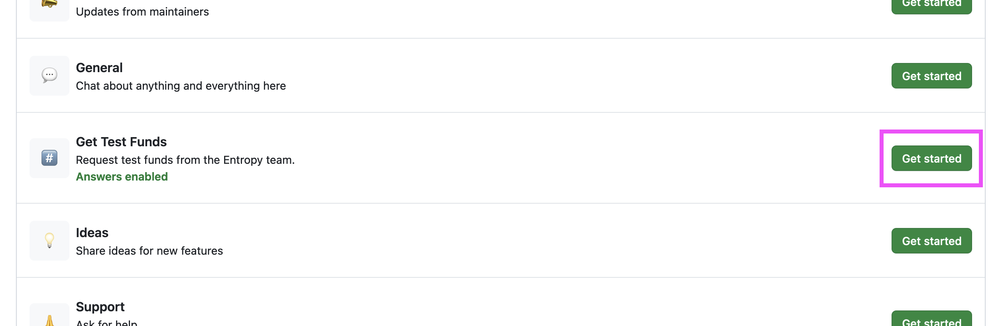

You need funds to interact with the Entropy blockchain network. To get these testing funds, you will need a GitHub account.

## Mainnet

The Entropy main network (mainnet) has yet to be released; as such, mainnet funds are not available.

## Testnet

Funds for testing are available from the manual faucet.

:::note
We're currently publically testing some of the Entropy tooling. As such, some of the workflows, like getting test funds, are a bit rough. We're building an automated faucet to hand out test funds, and we'll update this page when it's ready.
:::

1. Log into your GitHub account and go to [github.com/entropyxyz/community](https://github.com/entropyxyz/community).
1. Navigate to the **Discussions** tab and select **New discussion**.
1. Next to **Get Test Funds** click **Get started**:

   

1. In the **Title** field, enter the `address` you copied from the previous section.
1. Enter any text into the **Description** field; GitHub doesn't allow users to leave this field blank. If you need more than 10,000 test funds, enter the amount of funds you need and a reason why into this field.
1. Click **Start discussion**.

At this point, someone from Entropy will send you some test funds. This should happen within a couple of hours, but may be longer. Once they've sent the funds to the address you provided they'll let you know, and close the issue.
