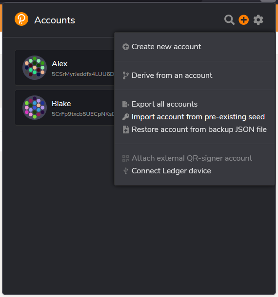
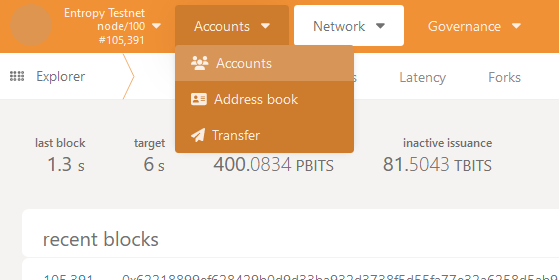
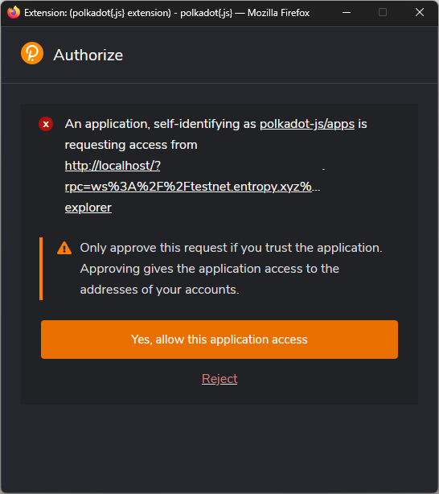
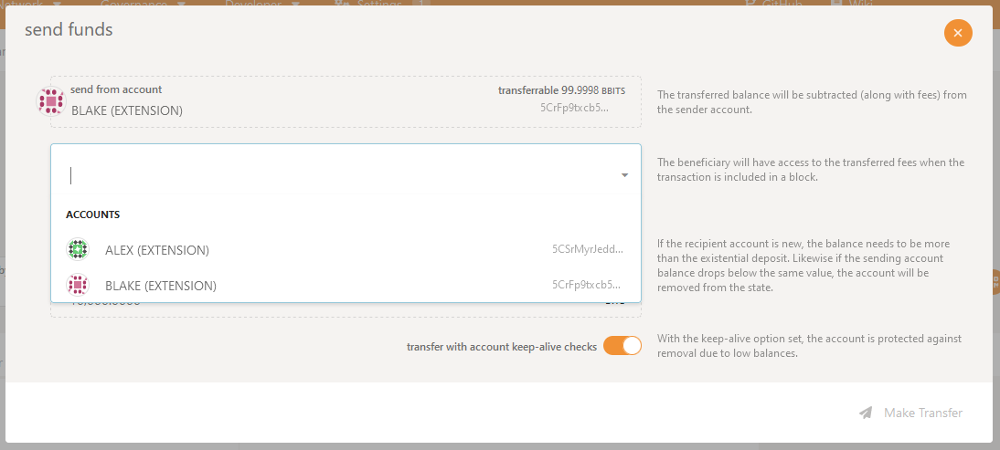
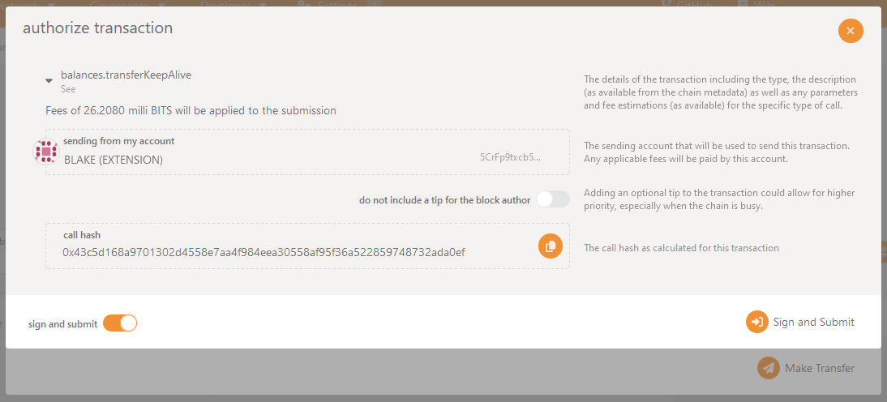

This page covers how to transfer funds between two addresses. There are several ways to complete a transfer; pick the process that best fits your situation. If you're unsure which process to follow, the [Substrate Explorer](#substrate-explorer) workflow is the easiest.

## Substrate explorer

### Prerequisites

To transfer funds, you must have the following:

- Access to at least 2 [Entropy accounts](./manage-accounts), one of which must have funds.
- Access to the [Polkadot.js explorer](./use-the-explorer).
- A Polkadot.js compatible browser wallet. This guide uses the [Polkadot\{.js\} Browser Extension](https://polkadot.js.org/extension/) as an example.

### Steps

1. Import the addresses into the wallet. In the Polkadot\{.js\} Browser Extension, this can be done by selecting the plus **+** icon and clicking **Import account from pre-existing seed**:

   

1. Start the Substrate explorer and connect to the `testnet.entropy.xyz:9944` network.
1. Select the **Accounts** dropdown and click **Accounts**.

   

1. A popup should display asking if you want to grant the Substrate Explorer access to your wallet. Click **Yes, allow this application access**.

   

1. Click **Send** on the account that you want to send funds _from_.
1. Select the account you want to send funds _to_ in the **send to address** dropdown.

   

1. Enter the number of tokens you want to send. The minimum number you can send is `10000`.
1. Click **Make Transfer**.
1. Review the details on this confirmation page and click **Sign and Submit**.

   

1. Enter your password if prompted, and click **Sign the transaction**.

That's it! The transaction will take up to 6 seconds to transfer funds from one account to another.

## CLI

You must have the Entropy CLI installed on your machine in order to transfer funds with this method. [Check out the installation instructions for more details](../reference/cli.md).

1. From the main menu in the CLI select **Manage Accounts**:

    ```output
    ? Select Action
    ❯ Manage Accounts
      Balance
      Register
      Sign
      Transfer
      Deploy Program
      User Programs
      Exit
    ```

1. Choose **Select Accounts**.
1. Select the account you want to transfer funds _from_.
1. Return to the main menu.
1. Select **Transfer**.
1. Enter the amount of funds you want to transfer.
1. Enter the address that you want to transfer funds _to_.

The transfer should take about 10 seconds.

## SDK

The feature is not currently available in the SDK. To track the progress of this upcoming guide, see [issue #81 in the Entropy Docs repository](https://github.com/entropyxyz/entropy-docs/issues/81).
