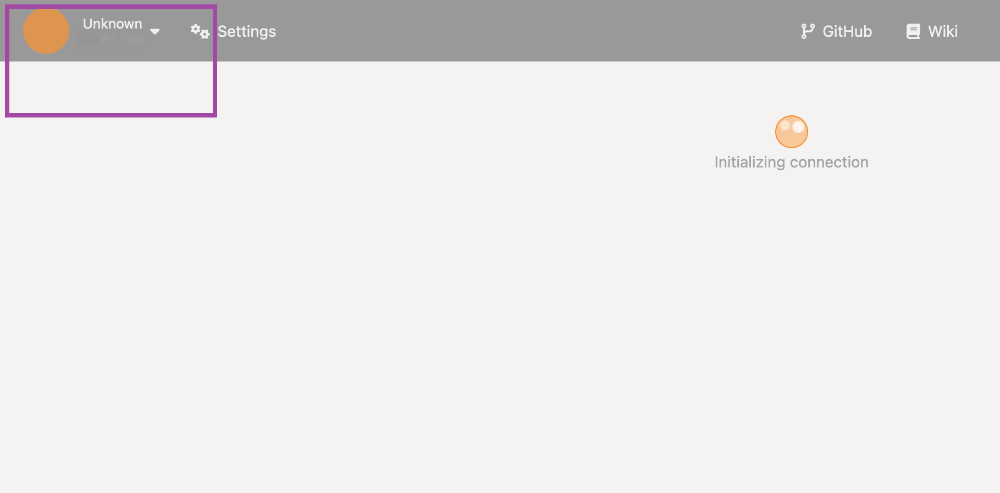
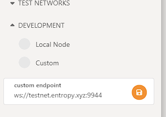
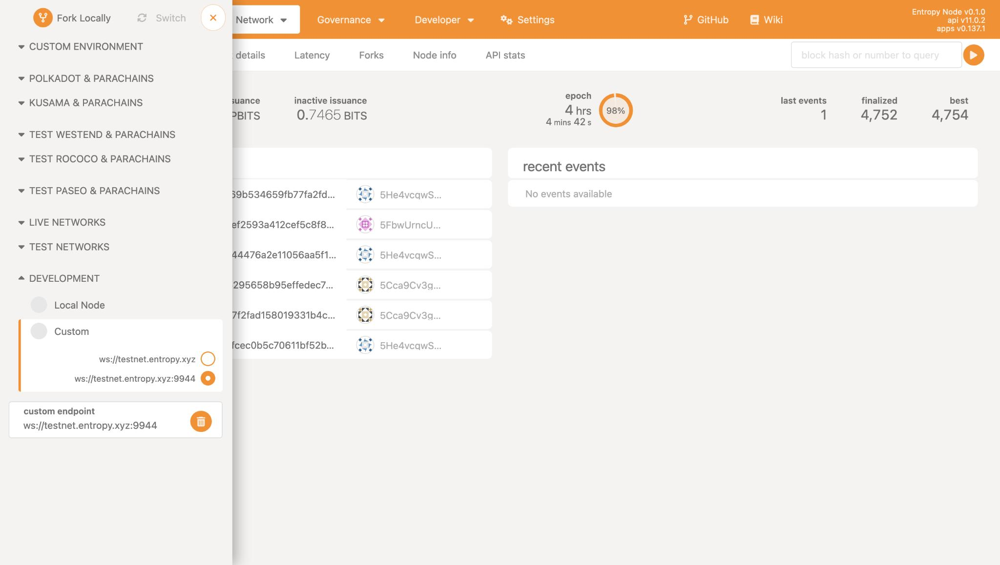

A blockchain explorer is a web-based tool that functions like a search engine specifically designed for blockchain data. Blockchains, like Entropy,  store information in public databases called ledgers. These ledgers are transparent, meaning anyone can view them. However, the data can be complex and challenging to understand without assistance. Blockchain explorers act as an interface, allowing users to quickly search, retrieve, and analyze information on the blockchain.

The [Polkadot\{.js\} Apps](https://polkadot.js.org/apps) is a user interface for interacting with Polkadot and Substrate blockchains. Since Entropy is built using Substrate, we can use this explorer to search and view chain data on the Entropy network.

## Prerequisites

- [Docker](https://docker.com)

:::note Why Docker?
The Entropy networks use regular WebSockets `ws://...`, rather than Secure WebSockets `wss://...`. Due to this limitation, you must run the Polkadot block explorer _locally_. The easiest way to do this is to use Docker.
:::

## Run the explorer

1. Open a terminal window and run:

    ```shell
    docker run --rm -it --name polkadot-ui -e WS_URL=ws://someip:9944 -p 80:80 jacogr/polkadot-js-apps:latest
    ```

    This command will start a background process.

1. Open a browser and go to `http://localhost`.

## Connect to the Entropy network

1. With the explorer running, select the **Unknown** dropdown at the top left:

    

1. In the sidebar, select the **Development** dropdown.
1. Within the **custom endpoint** field, enter the address for the network you want to connect to:

    ```plaintext
    # Testnet
    ws://testnet.entropy.xyz:9944
    ```

1. Click the **Save** icon next to the address field.

    

1. The block explorer should start populating with details from the Entropy network:

    

You should now be able to use the block explorer as usual. Check out the [Polkadot Wiki](https://wiki.polkadot.network/) for details on what information you can get from this blockchain explorer.
